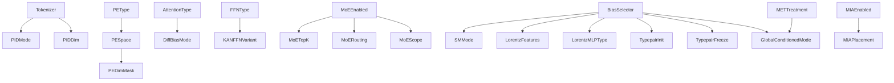

# Orthogonal Axes Reference

This is the frozen reference for the transformer-classifier design space used in the thesis. The authority order is:

1. Hydra config and implementation
2. `facts/axes.json` and W&B `axes/*`
3. W&B structured config keys and CSV exports
4. Slide decks and earlier notes

The frozen core is **33 numbered axes** across **5 groups**:

- Input representation: `D01-D06`
- Positional encoding: `D07-D09`
- Transformer architecture: `A01-A14`
- Physics-informed attention biases: `B01-B07`
- Pre-encoder modules: `P01-P03`

Hyperparameters (`H01-H10`), training-only switches, shared infrastructure, and legacy compatibility paths are documented here, but they are **not** part of the 33-axis count.

## Reading Guide
| Field | Meaning |
| --- | --- |
| `Config` | Canonical Hydra path |
| `axes` | Flat key from `src/thesis_ml/facts/axes.py`, mirrored to W&B as `axes/<key>` |
| `W&B` | Structured key emitted by `src/thesis_ml/utils/wandb_utils.py` |
| `Status` | `Fully swept`, `Partially swept`, `Tests only`, or `Not yet swept` |

## Dependency Graph

## 1. Input Representation

### D01. Tokenizer
- **Config:** `classifier.model.tokenizer.name`
- **axes:** `tokenizer_name`
- **W&B:** `tokenizer/type`
- **Settings:** `raw` · `identity` · `binned` · `pretrained`
- **Default:** `raw`
- **Prerequisite:** None
- **What it tests:** Whether the model works best from continuous kinematics, explicit PID-aware tokens, discrete bins, or a pretrained latent representation.
- **Existing experiments:** `emb_pe_4tbg`, `exp_binning_vs_direct`
- **Status:** Partially swept

### D02. PID Embedding Mode
- **Config:** `classifier.model.tokenizer.pid_mode`
- **axes:** `pid_mode`
- **W&B:** `tokenizer/pid_mode`
- **Settings:** `learned` · `one_hot` · `fixed_random`
- **Default:** `learned`
- **Prerequisite:** Meaningful when D01 = `identity`
- **What it tests:** Whether particle identity needs a learned geometry or only a fixed categorical code.
- **Existing experiments:** `pid_deepdive`, `thesis_plan/orthogonal_sweep_B`
- **Status:** Fully swept

### D03. PID Embedding Dimension
- **Config:** `classifier.model.tokenizer.id_embed_dim`
- **axes:** `id_embed_dim`
- **W&B:** `tokenizer/id_embed_dim`
- **Settings:** `8` · `16` · `32`
- **Default:** `8`
- **Prerequisite:** Meaningful when D01 = `identity`
- **What it tests:** The capacity of the PID embedding itself.
- **Existing experiments:** `pid_deepdive`
- **Status:** Fully swept

### D04. Continuous Feature Set
- **Config:** `data.cont_features`
- **axes:** `cont_features`
- **W&B:** `data/cont_features`
- **Settings:** `[0,1,2,3]` · `[1,2,3]`
- **Default:** Dataset-loader default unless overridden
- **Prerequisite:** None
- **What it tests:** Whether explicit energy information improves the particle representation.
- **Existing experiments:** `exp_binning_vs_direct`, `thesis_plan/orthogonal_sweep_B`
- **Status:** Partially swept

### D05. MET Treatment
- **Config:** `classifier.globals.include_met`
- **axes:** `include_met`
- **W&B:** `globals/include_met`
- **Settings:** `false` · `true`
- **Default:** `false`
- **Prerequisite:** None
- **What it tests:** Whether appending MET and METphi as globals/tokens improves event classification.
- **Existing experiments:** `emb_pe_4tbg`, `met_treatment`, `thesis_plan/orthogonal_sweep_B`
- **Status:** Partially swept

### D06. Token Ordering
- **Config:** `data.sort_tokens_by`, `data.shuffle_tokens`
- **axes:** `token_order`
- **W&B:** `data/sort_tokens_by`, `data/shuffle_tokens`
- **Settings:** `input_order` · `pt_sorted` · `shuffled`
- **Default:** `input_order`
- **Prerequisite:** None
- **What it tests:** Whether the model exploits ordering artifacts rather than true permutation-robust structure.
- **Existing experiments:** `order_pe_attention_4t_vs_bg`, `thesis_plan/orthogonal_sweep_C`
- **Status:** Partially swept

## 2. Positional Encoding

### D07. Positional Encoding Type
- **Config:** `classifier.model.positional`
- **axes:** `positional`
- **W&B:** `pos_enc/type`
- **Settings:** `none` · `sinusoidal` · `learned` · `rotary`
- **Default:** `sinusoidal`
- **Prerequisite:** None
- **What it tests:** Whether explicit position helps in a particle set that has no natural order.
- **Existing experiments:** `exp1_4t_vs_bg_sizes_and_pe`, `compare_positional_encodings`, `thesis_plan/orthogonal_sweep_A`
- **Status:** Fully swept

### D08. Positional Encoding Space
- **Config:** `classifier.model.positional_space`
- **axes:** `positional_space`
- **W&B:** `pos_enc/space`
- **Settings:** `model` · `token`
- **Default:** `model`
- **Prerequisite:** Most relevant when D07 is `sinusoidal` or `learned`
- **What it tests:** Whether positional information should act on projected embeddings or raw token channels.
- **Existing experiments:** `emb_pe_4tbg`, `exp2_4t_vs_bg_selective_masks`
- **Status:** Partially swept

### D09. Selective PE Dimension Mask
- **Config:** `classifier.model.positional_dim_mask`
- **axes:** `positional_dim_mask`
- **W&B:** `pos_enc/dim_mask`
- **Settings:** `null` and preset masks under `configs/classifier/positional_dim_mask/`
- **Default:** `null`
- **Prerequisite:** D08 = `token`
- **What it tests:** Which token channels benefit from positional encoding.
- **Existing experiments:** `exp2_4t_vs_bg_selective_masks`, `selective_positional_encoding`
- **Status:** Partially swept

## 3. Transformer Architecture

### A01. Normalization Policy
- **Config:** `classifier.model.norm.policy`
- **axes:** `norm_policy`
- **W&B:** `norm/policy`
- **Settings:** `pre` · `post` · `normformer`
- **Default:** `pre`
- **Prerequisite:** None
- **What it tests:** Where normalization should sit inside the encoder block.
- **Existing experiments:** `compare_norm_pos_pool`, `exp3_4t_vs_ttH_norm_policies`, `thesis_plan/orthogonal_sweep_A`
- **Status:** Fully swept

### A02. Normalization Type
- **Config:** `classifier.model.norm.type`
- **axes:** `norm_type`
- **W&B:** `norm/type`
- **Settings:** `layernorm` · `rmsnorm`
- **Default:** `layernorm`
- **Prerequisite:** None
- **What it tests:** Whether RMSNorm improves efficiency or stability relative to LayerNorm.
- **Existing experiments:** `exp_diff_attn_blocknorm`, `thesis_plan/orthogonal_sweep_A`
- **Status:** Fully swept

### A03. Attention Type
- **Config:** `classifier.model.attention.type`
- **axes:** `attention_type`
- **W&B:** `attention/type`
- **Settings:** `standard` · `differential`
- **Default:** `standard`
- **Prerequisite:** None
- **What it tests:** Whether differential attention improves robustness on short noisy particle sequences.
- **Existing experiments:** `exp_diff_attn_core`, `exp_diff_attn_blocknorm`, `exp_diff_attn_normformer`, `thesis_plan/orthogonal_sweep_A`
- **Status:** Fully swept

### A04. Attention-Internal Normalization
- **Config:** `classifier.model.attention.norm`
- **axes:** `attention_norm`
- **W&B:** `attention/norm`
- **Settings:** `none` · `layernorm` · `rmsnorm`
- **Default:** `none`
- **Prerequisite:** None
- **What it tests:** Whether per-head normalization inside the attention module stabilizes training.
- **Existing experiments:** `exp_diff_attn_core`, `thesis_plan/orthogonal_sweep_A`
- **Status:** Fully swept

### A05. Differential Attention Bias Mode
- **Config:** `classifier.model.attention.diff_bias_mode`
- **axes:** `diff_bias_mode`
- **W&B:** `attention/diff_bias_mode`
- **Settings:** `none` · `shared` · `split`
- **Default:** `shared`
- **Prerequisite:** A03 = `differential`
- **What it tests:** How additive physics bias should interact with the two differential-attention branches.
- **Existing experiments:** `exp_diff_attn_core`, `exp_diff_attn_blocknorm`, `exp_diff_attn_normformer`
- **Status:** Tests only

### A06. Pooling Strategy
- **Config:** `classifier.model.head.pooling`
- **axes:** `pooling`
- **W&B:** `pooling/type`
- **Settings:** `cls` · `mean` · `max`
- **Default:** `cls`
- **Prerequisite:** None
- **What it tests:** How token-level information should be aggregated into an event-level representation.
- **Existing experiments:** `compare_norm_pos_pool`, `exp_binning_vs_direct`, `thesis_plan/orthogonal_sweep_B`
- **Status:** Fully swept

### A07. Causal Attention
- **Config:** `classifier.model.causal_attention`
- **axes:** `causal_attention`
- **W&B:** `model/causal_attention`
- **Settings:** `false` · `true`
- **Default:** `false`
- **Prerequisite:** None
- **What it tests:** Whether an autoregressive mask helps or harms a set-based classifier.
- **Existing experiments:** `order_pe_attention_4t_vs_bg`, `thesis_plan/orthogonal_sweep_B`
- **Status:** Fully swept

### A08. FFN Type
- **Config:** `classifier.model.ffn.type`
- **axes:** `ffn_type`
- **W&B:** `ffn/type`
- **Settings:** `standard` · `kan`
- **Default:** `standard`
- **Prerequisite:** None
- **What it tests:** Whether KAN nonlinearities improve the feed-forward transformation.
- **Existing experiments:** `exp_kan_ffn`, `thesis_plan/orthogonal_sweep_A`
- **Status:** Partially swept

### A09. KAN FFN Variant
- **Config:** `classifier.model.ffn.kan.variant`
- **axes:** `kan_ffn_variant`
- **W&B:** `ffn/kan_variant`
- **Settings:** `hybrid` · `bottleneck` · `pure`
- **Default:** `hybrid`
- **Prerequisite:** A08 = `kan`
- **What it tests:** Where to place KAN inside the FFN stack.
- **Existing experiments:** `exp_kan_ffn`, `thesis_plan/orthogonal_sweep_A`
- **Status:** Partially swept

### A10. Classifier Head Type
- **Config:** `classifier.model.head.type`
- **axes:** `head_type`
- **W&B:** `head/type`
- **Settings:** `linear` · `kan` · `moe`
- **Default:** `linear`
- **Prerequisite:** None
- **What it tests:** Whether the final decision head benefits from KAN or MoE specialization.
- **Existing experiments:** `exp_kan_head`, `exp_moe_first_pass`, `thesis_plan/orthogonal_sweep_B`
- **Status:** Partially swept

### A11. MoE Enabled
- **Config:** `classifier.model.moe.enabled`
- **axes:** `moe_enabled`
- **W&B:** `moe/enabled`
- **Settings:** `false` · `true`
- **Default:** `false`
- **Prerequisite:** None
- **What it tests:** Whether sparse expert routing is beneficial at all.
- **Existing experiments:** `exp_moe_first_pass`, `thesis_plan/orthogonal_sweep_C`
- **Status:** Partially swept

### A12. MoE Top-K
- **Config:** `classifier.model.moe.top_k`
- **axes:** `moe_top_k`
- **W&B:** `moe/top_k`
- **Settings:** `1` · `2` · `3`
- **Default:** `1`
- **Prerequisite:** A11 = `true`
- **What it tests:** Whether routing to more than one expert improves capacity use.
- **Existing experiments:** `exp_moe_first_pass`, `thesis_plan/orthogonal_sweep_C`
- **Status:** Partially swept

### A13. MoE Routing Level
- **Config:** `classifier.model.moe.routing_level`
- **axes:** `moe_routing_level`
- **W&B:** `moe/routing_level`
- **Settings:** `token` · `event`
- **Default:** `token`
- **Prerequisite:** A11 = `true`
- **What it tests:** Whether routing should happen per token or per event representation.
- **Existing experiments:** `exp_moe_first_pass`, `thesis_plan/orthogonal_sweep_C`
- **Status:** Partially swept

### A14. MoE Scope
- **Config:** `classifier.model.moe.scope`
- **axes:** `moe_scope`
- **W&B:** `moe/scope`
- **Settings:** `head` · `middle_blocks` · `all_blocks`
- **Default:** `all_blocks`
- **Prerequisite:** A11 = `true`
- **What it tests:** Where expert specialization should be placed in the network.
- **Existing experiments:** `exp_moe_first_pass`, `thesis_plan/orthogonal_sweep_C`
- **Status:** Partially swept

## 4. Physics-Informed Attention Biases

### B01. Bias Selector
- **Config:** `classifier.model.attention_biases`
- **axes:** `attention_biases`
- **W&B:** `bias/selector`
- **Settings:** `none` · `lorentz_scalar` · `sm_interaction` · `typepair_kinematic` · `global_conditioned` · `+` combinations
- **Default:** `none`
- **Prerequisite:** Raw-token path required for these modules
- **What it tests:** Which physics-informed bias family, or combination of families, should shape attention logits.
- **Existing experiments:** `bias_experiments/*`, `thesis_plan/orthogonal_sweep_C`
- **Status:** Partially swept

### B02. SM Interaction Mode
- **Config:** `classifier.model.bias_config.sm_interaction.mode`
- **axes:** `sm_mode`
- **W&B:** `bias/sm_mode`
- **Settings:** `binary` · `fixed_coupling` · `running_coupling`
- **Default:** `binary`
- **Prerequisite:** B01 includes `sm_interaction`
- **What it tests:** The fidelity of the SM-inspired interaction prior.
- **Existing experiments:** `sm_progression`, `thesis_plan/orthogonal_sweep_C`
- **Status:** Partially swept

### B03. Lorentz Scalar Features
- **Config:** `classifier.model.bias_config.lorentz_scalar.features`
- **axes:** `lorentz_features`
- **W&B:** `bias/lorentz_features`
- **Settings:** ParT-like, MIParT-like, and custom subsets
- **Default:** `[m2, deltaR]`
- **Prerequisite:** B01 includes `lorentz_scalar`
- **What it tests:** Which Lorentz-invariant pairwise feature basis is most informative.
- **Existing experiments:** `lorentz_features`, `thesis_plan/orthogonal_sweep_C`
- **Status:** Partially swept

### B04. Lorentz MLP Type
- **Config:** `classifier.model.bias_config.lorentz_scalar.mlp_type`
- **axes:** `lorentz_mlp_type`
- **W&B:** `kan/bias_lorentz_mlp_type`
- **Settings:** `standard` · `kan`
- **Default:** `standard`
- **Prerequisite:** B01 includes `lorentz_scalar`
- **What it tests:** Whether KAN improves the nonlinear map from Lorentz features to bias scores.
- **Existing experiments:** `exp_kan_bias`
- **Status:** Tests only

### B05. Type-Pair Initialization
- **Config:** `classifier.model.bias_config.typepair_kinematic.init_from_physics`
- **axes:** `typepair_init`
- **W&B:** `bias/typepair_init`
- **Settings:** `none` · `binary` · `fixed_coupling`
- **Default:** `none`
- **Prerequisite:** B01 includes `typepair_kinematic`
- **What it tests:** Whether type-pair structure should be learned from scratch or seeded from physics.
- **Existing experiments:** `interpretability`, `thesis_plan/orthogonal_sweep_C`
- **Status:** Partially swept

### B06. Type-Pair Freeze
- **Config:** `classifier.model.bias_config.typepair_kinematic.freeze_table`
- **axes:** `typepair_freeze`
- **W&B:** `bias/typepair_freeze`
- **Settings:** `false` · `true`
- **Default:** `false`
- **Prerequisite:** B01 includes `typepair_kinematic`
- **What it tests:** Whether the type-pair table should stay as a fixed inductive bias or remain learnable.
- **Existing experiments:** `interpretability`
- **Status:** Partially swept

### B07. Global-Conditioned Bias Mode
- **Config:** `classifier.model.bias_config.global_conditioned.mode`
- **axes:** `global_conditioned_mode`
- **W&B:** `bias/global_mode`
- **Settings:** `global_scale` · `met_direction`
- **Default:** `global_scale`
- **Prerequisite:** B01 includes `global_conditioned`; `met_direction` is only meaningful when D05 = `true`
- **What it tests:** Whether globals should influence attention uniformly or through directional MET structure.
- **Existing experiments:** `met_treatment`, `thesis_plan/orthogonal_sweep_C`
- **Status:** Partially swept

## 5. Pre-Encoder Modules

### P01. Nodewise Mass Patch
- **Config:** `classifier.model.nodewise_mass.enabled`
- **axes:** `nodewise_mass_enabled`
- **W&B:** `nodewise_mass/enabled`
- **Settings:** `false` · `true`
- **Default:** `false`
- **Prerequisite:** Requires energy in D04
- **What it tests:** Whether local invariant-mass features help before the main encoder.
- **Existing experiments:** `bias_experiments/single_module_sweep`, `thesis_plan/orthogonal_sweep_C`
- **Status:** Tests only

### P02. MIA Encoder
- **Config:** `classifier.model.mia_blocks.enabled`
- **axes:** `mia_enabled`
- **W&B:** `mia/enabled`
- **Settings:** `false` · `true`
- **Default:** `false`
- **Prerequisite:** Raw-token path
- **What it tests:** Whether MIParT-style interaction-aware pre-encoding adds useful structure before self-attention.
- **Existing experiments:** `bias_experiments/single_module_sweep`, `thesis_plan/orthogonal_sweep_C`
- **Status:** Tests only

### P03. MIA Placement
- **Config:** `classifier.model.mia_blocks.placement`
- **axes:** `mia_placement`
- **W&B:** `mia/placement`
- **Settings:** `prepend` · `append` · `interleave`
- **Default:** `prepend`
- **Prerequisite:** P02 = `true`
- **What it tests:** Where the MIA block should sit relative to the main encoder.
- **Existing experiments:** Configuration support only
- **Status:** Not yet swept
- **Note:** `interleave` is accepted by config, but the implementation currently warns and falls back to `prepend`.

## Hyperparameter Axes

These are documented for completeness and W&B traceability, but they are not part of the 33-axis architectural count.

| ID | Axis | Config | axes | W&B |
| --- | --- | --- | --- | --- |
| H01 | Model dimension | `classifier.model.dim` | `dim` | `model/dim` |
| H02 | Encoder depth | `classifier.model.depth` | `depth` | `model/depth` |
| H03 | Attention heads | `classifier.model.heads` | `heads` | `model/heads` |
| H04 | FFN hidden dim | `classifier.model.mlp_dim` | `mlp_dim` | `model/mlp_dim` |
| H05 | Dropout | `classifier.model.dropout` | `dropout` | `model/dropout` |
| H06 | Learning rate | `classifier.trainer.lr` | `lr` | `training/lr` |
| H07 | Weight decay | `classifier.trainer.weight_decay` | `weight_decay` | `training/weight_decay` |
| H08 | Batch size | `classifier.trainer.batch_size` | `batch_size` | `training/batch_size` |
| H09 | Seed | `classifier.trainer.seed` | `seed` | `training/seed` |
| H10 | Model size label | derived `d{dim}_L{depth}` | `model_size_key` | `model/size_key` |

## Logged Sub-Settings And Non-Core Appendices

These are implemented or logged, but they stay outside the numbered 33-axis core.

| Bucket | Config | axes | W&B | Notes |
| --- | --- | --- | --- | --- |
| Rotary base | `classifier.model.rotary.base` | — | `pos_enc/rotary_base` | D07 sub-setting |
| KAN global params | `classifier.model.kan.*` | `kan_grid_size`, `kan_spline_order` | `kan/*` | Shared by FFN, head, and bias KAN |
| KAN FFN bottleneck dim | `classifier.model.ffn.kan.bottleneck_dim` | — | `raw/*` | A09 sub-setting |
| MoE num experts | `classifier.model.moe.num_experts` | — | `moe/num_experts` | A11-A14 sub-setting |
| MoE load-balance weight | `classifier.model.moe.load_balance_loss_weight` | — | `moe/lb_weight` | A11-A14 sub-setting |
| MoE noisy gating | `classifier.model.moe.noisy_gating` | — | `moe/noisy_gating` | A11-A14 sub-setting |
| Lorentz per-head | `classifier.model.bias_config.lorentz_scalar.per_head` | `lorentz_per_head` | `bias/lorentz_per_head` | B03/B04 sub-setting |
| Lorentz sparse gating | `classifier.model.bias_config.lorentz_scalar.sparse_gating` | `lorentz_sparse_gating` | `bias/lorentz_sparse_gating` | B03/B04 sub-setting |
| Typepair kinematic gate | `classifier.model.bias_config.typepair_kinematic.kinematic_gate` | `typepair_kinematic_gate` | `bias/typepair_kinematic_gate` | B05/B06 sub-setting |
| Nodewise mass details | `classifier.model.nodewise_mass.k_values`, `hidden_dim` | — | `nodewise_mass/k_values` | P01 sub-settings |
| MIA details | `classifier.model.mia_blocks.num_blocks`, `interaction_dim`, `reduction_dim`, `dropout` | — | `mia/num_blocks` | P02/P03 sub-settings |
| PID schedule | `classifier.trainer.pid_schedule.*` | — | `pid/schedule_mode`, `pid/transition_epoch` | Training protocol, not D03 |
| Shared backbone | `classifier.model.shared_backbone.*` | — | `raw/classifier.model.shared_backbone/*` | Infrastructure shared by bias/MIA |
| Legacy pairwise | `classifier.model.attn_pairwise.*` | — | `raw/classifier.model.attn_pairwise/*` | Backward-compat path into Lorentz bias |

## Recommended W&B CSV Keys

If the goal is a CSV that is both thesis-complete and easy to slice later, the safest rule is:

1. Export the full canonical `axes/*` surface for every numbered axis.
2. Add a small set of metadata and training-protocol keys so you know what data and training setup went into the run.
3. Add structured module sub-settings only when they materially affect interpretation or reproducibility.

The tables below are based on keys that are actually built by `src/thesis_ml/facts/axes.py`, `src/thesis_ml/utils/wandb_utils.py`, or `meta.*` extraction in the same module.

### Must Have

These are the keys that give you a robust thesis CSV: all axes, task identity, data-treatment identity, and the core training protocol.

| W&B key | Config source | Maps to / note |
| --- | --- | --- |
| `axes/<all numbered-axis keys from completeness table below>` | See completeness table below | All frozen thesis axes (`D01-D09`, `A01-A14`, `B01-B07`, `P01-P03`) |
| `data/name` | `data.name` or `data.path` | Dataset identity |
| `meta.process_groups_key` | derived from `data.classifier.signal_vs_background` and `data.classifier.selected_labels` | Canonical task/class split for grouping |
| `meta.class_def_str` | derived from `data.classifier.signal_vs_background` and `data.classifier.selected_labels` | Human-readable class definition |
| `meta.row_key` | derived from dataset identity and process groups | Stable join key across reports |
| `meta.datatreatment_tokenization` | derived from `data.use_binned_tokens`, `classifier.model.tokenizer.name` | High-level tokenization summary |
| `meta.datatreatment_pid_encoding` | derived from `classifier.model.tokenizer.name`, `classifier.model.tokenizer.id_embed_dim` | High-level PID treatment summary |
| `meta.datatreatment_met_rep` | derived from `classifier.globals.include_met`, `data.globals.*` | How MET is represented in the run |
| `training/epochs` | `classifier.trainer.epochs` | Core training protocol |
| `training/warmup_steps` | `classifier.trainer.warmup_steps` | Core training protocol |
| `training/lr_schedule` | `classifier.trainer.lr_schedule` | Core training protocol |
| `training/label_smoothing` | `classifier.trainer.label_smoothing` | Core training protocol |
| `training/grad_clip` | `classifier.trainer.grad_clip` | Core training protocol |
| `early_stop/enabled` | `classifier.trainer.early_stopping.enabled` | Training control |
| `early_stop/patience` | `classifier.trainer.early_stopping.patience` | Training control |

### Nice To Have

These improve interpretability and reproducibility once the must-have layer is present.

| W&B key | Config source | Maps to / note |
| --- | --- | --- |
| `pos_enc/rotary_base` | `classifier.model.rotary.base` | D07 rotary sub-setting |
| `pid/schedule_mode` | `classifier.trainer.pid_schedule.mode` | PID training protocol, not D03 |
| `pid/transition_epoch` | `classifier.trainer.pid_schedule.transition_epoch` | PID training protocol, not D03 |
| `meta.datatreatment_globals_included` | derived from `data.globals.present` | High-level data-treatment note |
| `meta.datatreatment_feature_set_version` | derived from metadata schema | Useful when feature definitions evolve |
| `meta.datatreatment_normalization` | `data.norm` | High-level data-treatment note |
| `kan/grid_size` | `classifier.model.kan.grid_size` | KAN shared sub-setting |
| `kan/spline_order` | `classifier.model.kan.spline_order` | KAN shared sub-setting |
| `kan/grid_range` | `classifier.model.kan.grid_range` | KAN shared sub-setting |
| `kan/spline_reg_weight` | `classifier.model.kan.spline_regularization_weight` | KAN shared sub-setting |
| `kan/grid_update_freq` | `classifier.model.kan.grid_update_freq` | KAN shared sub-setting |
| `moe/num_experts` | `classifier.model.moe.num_experts` | MoE sub-setting for A11-A14 |
| `moe/lb_weight` | `classifier.model.moe.load_balance_loss_weight` | MoE sub-setting for A11-A14 |
| `moe/noisy_gating` | `classifier.model.moe.noisy_gating` | MoE sub-setting for A11-A14 |
| `nodewise_mass/k_values` | `classifier.model.nodewise_mass.k_values` | P01 sub-setting |
| `mia/num_blocks` | `classifier.model.mia_blocks.num_blocks` | P02/P03 sub-setting |
| `tokenizer/model_type` | `classifier.model.tokenizer.model_type` | Mainly relevant for pretrained tokenizers |

### Full Export

If you want the most complete CSV without exporting the entire raw Hydra tree, this is the next layer to add.

| W&B key | Config source | Maps to / note |
| --- | --- | --- |
| `kan/bias_lorentz_mlp_type` | `classifier.model.bias_config.lorentz_scalar.mlp_type` | Structured mirror of B04 |
| `kan/bias_global_mlp_type` | `classifier.model.bias_config.global_conditioned.mlp_type` | B07 sub-setting |
| `bias/lorentz_per_head` | `classifier.model.bias_config.lorentz_scalar.per_head` | B03/B04 sub-setting |
| `bias/lorentz_sparse_gating` | `classifier.model.bias_config.lorentz_scalar.sparse_gating` | B03/B04 sub-setting |
| `bias/typepair_kinematic_gate` | `classifier.model.bias_config.typepair_kinematic.kinematic_gate` | B05/B06 sub-setting |
| `raw/classifier.model.ffn.kan.bottleneck_dim` | `classifier.model.ffn.kan.bottleneck_dim` | A09 sub-setting not otherwise curated |
| `raw/classifier.model.bias_config.lorentz_scalar.hidden_dim` | `classifier.model.bias_config.lorentz_scalar.hidden_dim` | Bias-capacity detail |
| `raw/classifier.model.bias_config.typepair_kinematic.kinematic_feature` | `classifier.model.bias_config.typepair_kinematic.kinematic_feature` | Typepair detail |
| `raw/classifier.model.bias_config.typepair_kinematic.mask_value` | `classifier.model.bias_config.typepair_kinematic.mask_value` | Typepair detail |
| `raw/classifier.model.bias_config.sm_interaction.mask_value` | `classifier.model.bias_config.sm_interaction.mask_value` | SM bias detail |
| `raw/classifier.model.bias_config.global_conditioned.global_dim` | `classifier.model.bias_config.global_conditioned.global_dim` | Global-bias capacity detail |
| `raw/classifier.model.mia_blocks.interaction_dim` | `classifier.model.mia_blocks.interaction_dim` | P02 capacity detail |
| `raw/classifier.model.mia_blocks.reduction_dim` | `classifier.model.mia_blocks.reduction_dim` | P02/P03 capacity detail |
| `raw/classifier.model.mia_blocks.dropout` | `classifier.model.mia_blocks.dropout` | P02/P03 training detail |
| `raw/classifier.model.nodewise_mass.hidden_dim` | `classifier.model.nodewise_mass.hidden_dim` | P01 capacity detail |
| `raw/classifier.trainer.pid_schedule.reinit_mode` | `classifier.trainer.pid_schedule.reinit_mode` | PID training-protocol detail |
| `raw/classifier.trainer.pid_schedule.pid_lr` | `classifier.trainer.pid_schedule.pid_lr` | PID training-protocol detail |
| `raw/classifier.trainer.log_pid_embeddings` | `classifier.trainer.log_pid_embeddings` | PID logging detail |
| `raw/classifier.model.shared_backbone.enabled` | `classifier.model.shared_backbone.enabled` | Shared infrastructure toggle |
| `raw/classifier.model.shared_backbone.features` | `classifier.model.shared_backbone.features` | Shared infrastructure detail |
| `raw/classifier.model.attn_pairwise.enabled` | `classifier.model.attn_pairwise.enabled` | Legacy compatibility path |
| `raw/classifier.model.attn_pairwise.features` | `classifier.model.attn_pairwise.features` | Legacy compatibility path |

## Axis Completeness Table

This is the easiest completeness check for the frozen axis set. If you want one CSV column per axis, the preferred key is the `axes/*` key below.

| Axis | Config key | Preferred CSV W&B key | Also logged as |
| --- | --- | --- | --- |
| D01 | `classifier.model.tokenizer.name` | `axes/tokenizer_name` | `tokenizer/type` |
| D02 | `classifier.model.tokenizer.pid_mode` | `axes/pid_mode` | `tokenizer/pid_mode` |
| D03 | `classifier.model.tokenizer.id_embed_dim` | `axes/id_embed_dim` | `tokenizer/id_embed_dim` |
| D04 | `data.cont_features` | `axes/cont_features` | `data/cont_features` |
| D05 | `classifier.globals.include_met` | `axes/include_met` | `globals/include_met` |
| D06 | `data.sort_tokens_by`, `data.shuffle_tokens` | `axes/token_order` | `data/sort_tokens_by`, `data/shuffle_tokens` |
| D07 | `classifier.model.positional` | `axes/positional` | `pos_enc/type` |
| D08 | `classifier.model.positional_space` | `axes/positional_space` | `pos_enc/space` |
| D09 | `classifier.model.positional_dim_mask` | `axes/positional_dim_mask` | `pos_enc/dim_mask` |
| A01 | `classifier.model.norm.policy` | `axes/norm_policy` | `norm/policy` |
| A02 | `classifier.model.norm.type` | `axes/norm_type` | `norm/type` |
| A03 | `classifier.model.attention.type` | `axes/attention_type` | `attention/type` |
| A04 | `classifier.model.attention.norm` | `axes/attention_norm` | `attention/norm` |
| A05 | `classifier.model.attention.diff_bias_mode` | `axes/diff_bias_mode` | `attention/diff_bias_mode` |
| A06 | `classifier.model.head.pooling` | `axes/pooling` | `pooling/type` |
| A07 | `classifier.model.causal_attention` | `axes/causal_attention` | `model/causal_attention` |
| A08 | `classifier.model.ffn.type` | `axes/ffn_type` | `ffn/type` |
| A09 | `classifier.model.ffn.kan.variant` | `axes/kan_ffn_variant` | `ffn/kan_variant` |
| A10 | `classifier.model.head.type` | `axes/head_type` | `head/type` |
| A11 | `classifier.model.moe.enabled` | `axes/moe_enabled` | `moe/enabled` |
| A12 | `classifier.model.moe.top_k` | `axes/moe_top_k` | `moe/top_k` |
| A13 | `classifier.model.moe.routing_level` | `axes/moe_routing_level` | `moe/routing_level` |
| A14 | `classifier.model.moe.scope` | `axes/moe_scope` | `moe/scope` |
| B01 | `classifier.model.attention_biases` | `axes/attention_biases` | `bias/selector` |
| B02 | `classifier.model.bias_config.sm_interaction.mode` | `axes/sm_mode` | `bias/sm_mode` |
| B03 | `classifier.model.bias_config.lorentz_scalar.features` | `axes/lorentz_features` | `bias/lorentz_features` |
| B04 | `classifier.model.bias_config.lorentz_scalar.mlp_type` | `axes/lorentz_mlp_type` | `kan/bias_lorentz_mlp_type` |
| B05 | `classifier.model.bias_config.typepair_kinematic.init_from_physics` | `axes/typepair_init` | `bias/typepair_init` |
| B06 | `classifier.model.bias_config.typepair_kinematic.freeze_table` | `axes/typepair_freeze` | `bias/typepair_freeze` |
| B07 | `classifier.model.bias_config.global_conditioned.mode` | `axes/global_conditioned_mode` | `bias/global_mode` |
| P01 | `classifier.model.nodewise_mass.enabled` | `axes/nodewise_mass_enabled` | `nodewise_mass/enabled` |
| P02 | `classifier.model.mia_blocks.enabled` | `axes/mia_enabled` | `mia/enabled` |
| P03 | `classifier.model.mia_blocks.placement` | `axes/mia_placement` | `mia/placement` |
| H01 | `classifier.model.dim` | `axes/dim` | `model/dim` |
| H02 | `classifier.model.depth` | `axes/depth` | `model/depth` |
| H03 | `classifier.model.heads` | `axes/heads` | `model/heads` |
| H04 | `classifier.model.mlp_dim` | `axes/mlp_dim` | `model/mlp_dim` |
| H05 | `classifier.model.dropout` | `axes/dropout` | `model/dropout` |
| H06 | `classifier.trainer.lr` | `axes/lr` | `training/lr` |
| H07 | `classifier.trainer.weight_decay` | `axes/weight_decay` | `training/weight_decay` |
| H08 | `classifier.trainer.batch_size` | `axes/batch_size` | `training/batch_size` |
| H09 | `classifier.trainer.seed` | `axes/seed` | `training/seed` if extractor is fixed to read `classifier.trainer.seed` consistently |
| H10 | derived from `classifier.model.dim`, `classifier.model.depth` | `axes/model_size_key` | `model/size_key` |

## Stability Notes

- D03 stays frozen as **PID embedding dimension**. The March 31 slides used `D03` for PID schedule, but code and W&B currently separate schedule under `pid/*`.
- B05 and B06 stay split as independent numbered axes because they have separate config keys and separate `axes/*` mirrors.
- `typepair_kinematic_gate`, `lorentz_per_head`, and `lorentz_sparse_gating` remain documented sub-settings, not numbered axes.
- `classifier.model.shared_backbone.*` is real infrastructure consumed by code, but not a thesis axis because it is neither exposed as a canonical `axes/*` key nor used as a standalone sweep dimension.
- `classifier.model.attn_pairwise.*` remains legacy compatibility. When `attention_biases` is unset or `none`, code can still map it to `lorentz_scalar`.
- The current implementation accepts `mia_blocks.placement=interleave`, but falls back to `prepend`.

## Appendix: Proposed Thesis-Facing Axis Taxonomy

This section is a presentation-layer proposal only. It does **not** replace the frozen reference above and does **not** require code changes. The goal is to make the thesis language more honest than a flat list of "orthogonal axes" by separating:

- primary axes: the main architectural decision
- sub-axes: only meaningful when the parent axis activates a module or family
- sub-sub-axes: technical settings inside a selected variant

### Why revise the taxonomy

The current `D01`, `A05`, `B03` style is useful as a checklist, but it mixes together:

- independent top-level choices
- conditional choices
- selector axes and module-internal parameterizations

The configs and the slides both already imply hierarchy in several places:

- `A09` KAN FFN variant only matters when `A08 = kan`
- `A11` MoE settings only matter when MoE is active
- `B01` bias selector activates modules that each have their own internal settings
- the slides already talk about "subchoices" for MoE and bundled sub-items for the bias modules

### Proposed naming rule

Keep the existing top-level IDs as the stable thesis anchors, but allow hierarchical suffixes:

- top-level axis: `A09`
- first dependent sub-axis: `A09-A`, `A09-B`
- second dependent sub-axis: `A09-B1`, `A09-B2`

This keeps the familiar "where in the transformer" naming, while making dependency explicit.

### Recommended taxonomy levels

| Level | Meaning | Example |
| --- | --- | --- |
| Top-level axis | Main design decision | `A08` FFN type |
| Sub-axis | Only active for one branch of the parent | `A09-A` KAN FFN variant |
| Sub-sub-axis | Only active inside one sub-axis choice | `A09-A1` bottleneck dimension |

### Proposed thesis-facing structure

#### D. Input Representation

Keep `D01-D09` as the top-level chapter anchors. Introduce sub-axes only where the current doc already has strong conditionality.

| Proposed ID | Meaning | Config |
| --- | --- | --- |
| `D01` | Tokenizer family | `classifier.model.tokenizer.name` |
| `D01-A` | PID representation mode | `classifier.model.tokenizer.pid_mode` |
| `D01-B` | PID embedding dimension | `classifier.model.tokenizer.id_embed_dim` |
| `D04` | Continuous feature set | `data.cont_features` |
| `D05` | MET treatment | `classifier.globals.include_met` |
| `D06` | Token ordering policy | `data.sort_tokens_by`, `data.shuffle_tokens` |
| `D07` | Positional encoding type | `classifier.model.positional` |
| `D07-A` | Positional encoding space | `classifier.model.positional_space` |
| `D07-B` | Positional dimension mask | `classifier.model.positional_dim_mask` |
| `D07-C` | Rotary base | `classifier.model.rotary.base` |

**Rationale:** `D02` and `D03` read naturally as dependent on tokenizer choice. For thesis prose, folding them under `D01` may be cleaner even if the frozen reference keeps `D02` and `D03` as separate documented axes.

#### A. Transformer Architecture

This is where the hierarchy is strongest in both the configs and the slides.

| Proposed ID | Meaning | Config |
| --- | --- | --- |
| `A01` | Normalization policy | `classifier.model.norm.policy` |
| `A02` | Normalization type | `classifier.model.norm.type` |
| `A03` | Attention type | `classifier.model.attention.type` |
| `A03-A` | Differential-attention bias mode | `classifier.model.attention.diff_bias_mode` |
| `A03-B` | Attention-internal normalization | `classifier.model.attention.norm` |
| `A04` | Pooling strategy | `classifier.model.head.pooling` |
| `A05` | Causal attention | `classifier.model.causal_attention` |
| `A06` | FFN family | `classifier.model.ffn.type` |
| `A06-A` | KAN FFN variant | `classifier.model.ffn.kan.variant` |
| `A06-A1` | KAN bottleneck dimension | `classifier.model.ffn.kan.bottleneck_dim` |
| `A07` | Head family | `classifier.model.head.type` |
| `A08` | MoE activation / use | `classifier.model.moe.enabled` and head/path activation |
| `A08-A` | MoE routing level | `classifier.model.moe.routing_level` |
| `A08-B` | MoE scope | `classifier.model.moe.scope` |
| `A08-C` | MoE top-k | `classifier.model.moe.top_k` |
| `A08-D` | MoE number of experts | `classifier.model.moe.num_experts` |
| `A08-E` | MoE load-balance weight | `classifier.model.moe.load_balance_loss_weight` |
| `A08-F` | MoE noisy gating | `classifier.model.moe.noisy_gating` |

**Rationale:** the March 31 slides already imply this. They show MoE as a family with "subchoices", and KAN FFN as a family with internal variants. A thesis-facing hierarchy is cleaner than treating every MoE setting as the same kind of axis as normalization policy.

#### B. Physics-Informed Attention Biases

This is the most natural place to use selector-plus-subaxes language.

| Proposed ID | Meaning | Config |
| --- | --- | --- |
| `B01` | Bias family selector | `classifier.model.attention_biases` |
| `B01-A` | Lorentz-scalar bias family | `lorentz_scalar` selected in `attention_biases` |
| `B01-A1` | Lorentz feature set | `classifier.model.bias_config.lorentz_scalar.features` |
| `B01-A2` | Lorentz MLP type | `classifier.model.bias_config.lorentz_scalar.mlp_type` |
| `B01-A3` | Lorentz per-head mode | `classifier.model.bias_config.lorentz_scalar.per_head` |
| `B01-A4` | Lorentz sparse gating | `classifier.model.bias_config.lorentz_scalar.sparse_gating` |
| `B01-B` | Type-pair bias family | `typepair_kinematic` selected in `attention_biases` |
| `B01-B1` | Type-pair initialization | `classifier.model.bias_config.typepair_kinematic.init_from_physics` |
| `B01-B2` | Type-pair freeze | `classifier.model.bias_config.typepair_kinematic.freeze_table` |
| `B01-B3` | Type-pair kinematic gating | `classifier.model.bias_config.typepair_kinematic.kinematic_gate` |
| `B01-B4` | Type-pair kinematic feature | `classifier.model.bias_config.typepair_kinematic.kinematic_feature` |
| `B01-C` | SM-interaction bias family | `sm_interaction` selected in `attention_biases` |
| `B01-C1` | SM interaction mode | `classifier.model.bias_config.sm_interaction.mode` |
| `B01-D` | Global-conditioned bias family | `global_conditioned` selected in `attention_biases` |
| `B01-D1` | Global-conditioned mode | `classifier.model.bias_config.global_conditioned.mode` |
| `B01-D2` | Global-conditioned MLP type | `classifier.model.bias_config.global_conditioned.mlp_type` |

**Rationale:** this is probably the cleanest thesis-facing story. Instead of pretending `B02-B07` are all equally independent, you can say that `B01` chooses the bias family and `B01-A*`, `B01-B*`, `B01-C*`, `B01-D*` parameterize the selected family.

#### P. Pre-Encoder Modules

These are naturally modular and also benefit from hierarchy.

| Proposed ID | Meaning | Config |
| --- | --- | --- |
| `P01` | Nodewise mass module on/off | `classifier.model.nodewise_mass.enabled` |
| `P01-A` | Nodewise mass neighborhood sizes | `classifier.model.nodewise_mass.k_values` |
| `P01-B` | Nodewise mass hidden dimension | `classifier.model.nodewise_mass.hidden_dim` |
| `P02` | MIA encoder on/off | `classifier.model.mia_blocks.enabled` |
| `P02-A` | MIA placement | `classifier.model.mia_blocks.placement` |
| `P02-B` | MIA number of blocks | `classifier.model.mia_blocks.num_blocks` |
| `P02-C` | MIA interaction dimension | `classifier.model.mia_blocks.interaction_dim` |
| `P02-D` | MIA reduction dimension | `classifier.model.mia_blocks.reduction_dim` |
| `P02-E` | MIA dropout | `classifier.model.mia_blocks.dropout` |

### Suggested thesis language

If you adopt this taxonomy in the thesis, a more accurate phrasing would be:

- "The codebase exposes a frozen set of top-level architectural axes, each with optional dependent sub-axes."
- "Some chapters focus on top-level axes, while module deep-dives examine second-level sub-axes."
- "The W&B overview can be backfilled so both top-level axes and dependent sub-axes remain queryable."

### Recommended compromise with the current reference

To minimize disruption:

- keep the frozen reference above exactly as the canonical checklist
- use the hierarchy in thesis figures, chapter intros, and result tables
- refer to sub-axes only when the parent family is active
- avoid calling the whole set "fully orthogonal"; prefer "design axes with dependencies"

### My recommended final presentation choice

If I had to choose one thesis-facing structure, I would use:

- `Dxx` for input and representation
- `Axx` for top-level transformer architecture
- `Axx-A`, `Axx-B`, ... for architecture sub-axes
- `B01` as the master bias selector, with `B01-A*`, `B01-B*`, `B01-C*`, `B01-D*` for family-specific sub-axes
- `Pxx` for pre-encoder modules with `Pxx-*` internal settings

That is the closest match to the actual configs, the current `AXES_REFERENCE`, and the structure already hinted at in the slides.
