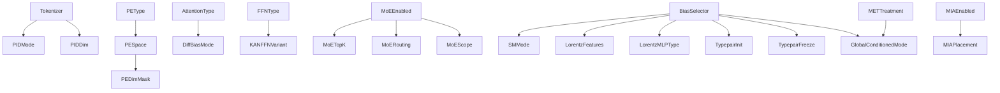

# Orthogonal Axes Reference

This is the frozen reference for the transformer-classifier design space used in the thesis. The authority order is:

1. Hydra config and implementation
2. `facts/axes.json` and W&B `axes/*`
3. W&B structured config keys and CSV exports
4. Slide decks and earlier notes

The frozen core is **33 numbered axes** across **5 groups**:

- Input representation: `D01-D06`
- Positional encoding: `D07-D09`
- Transformer architecture: `A01-A14`
- Physics-informed attention biases: `B01-B07`
- Pre-encoder modules: `P01-P03`

Hyperparameters (`H01-H10`), training-only switches, shared infrastructure, and legacy compatibility paths are documented here, but they are **not** part of the 33-axis count.

## Reading Guide
| Field | Meaning |
| --- | --- |
| `Config` | Canonical Hydra path |
| `axes` | Flat key from `src/thesis_ml/facts/axes.py`, mirrored to W&B as `axes/<key>` |
| `W&B` | Structured key emitted by `src/thesis_ml/utils/wandb_utils.py` |
| `Status` | `Fully swept`, `Partially swept`, `Tests only`, or `Not yet swept` |

## Dependency Graph

## 1. Input Representation

### D01. Tokenizer
- **Config:** `classifier.model.tokenizer.name`
- **axes:** `tokenizer_name`
- **W&B:** `tokenizer/type`
- **Settings:** `raw` · `identity` · `binned` · `pretrained`
- **Default:** `raw`
- **Prerequisite:** None
- **What it tests:** Whether the model works best from continuous kinematics, explicit PID-aware tokens, discrete bins, or a pretrained latent representation.
- **Existing experiments:** `emb_pe_4tbg`, `exp_binning_vs_direct`
- **Status:** Partially swept

### D02. PID Embedding Mode
- **Config:** `classifier.model.tokenizer.pid_mode`
- **axes:** `pid_mode`
- **W&B:** `tokenizer/pid_mode`
- **Settings:** `learned` · `one_hot` · `fixed_random`
- **Default:** `learned`
- **Prerequisite:** Meaningful when D01 = `identity`
- **What it tests:** Whether particle identity needs a learned geometry or only a fixed categorical code.
- **Existing experiments:** `pid_deepdive`, `thesis_plan/orthogonal_sweep_B`
- **Status:** Fully swept

### D03. PID Embedding Dimension
- **Config:** `classifier.model.tokenizer.id_embed_dim`
- **axes:** `id_embed_dim`
- **W&B:** `tokenizer/id_embed_dim`
- **Settings:** `8` · `16` · `32`
- **Default:** `8`
- **Prerequisite:** Meaningful when D01 = `identity`
- **What it tests:** The capacity of the PID embedding itself.
- **Existing experiments:** `pid_deepdive`
- **Status:** Fully swept

### D04. Continuous Feature Set
- **Config:** `data.cont_features`
- **axes:** `cont_features`
- **W&B:** `data/cont_features`
- **Settings:** `[0,1,2,3]` · `[1,2,3]`
- **Default:** Dataset-loader default unless overridden
- **Prerequisite:** None
- **What it tests:** Whether explicit energy information improves the particle representation.
- **Existing experiments:** `exp_binning_vs_direct`, `thesis_plan/orthogonal_sweep_B`
- **Status:** Partially swept

### D05. MET Treatment
- **Config:** `classifier.globals.include_met`
- **axes:** `include_met`
- **W&B:** `globals/include_met`
- **Settings:** `false` · `true`
- **Default:** `false`
- **Prerequisite:** None
- **What it tests:** Whether appending MET and METphi as globals/tokens improves event classification.
- **Existing experiments:** `emb_pe_4tbg`, `met_treatment`, `thesis_plan/orthogonal_sweep_B`
- **Status:** Partially swept

### D06. Token Ordering
- **Config:** `data.sort_tokens_by`, `data.shuffle_tokens`
- **axes:** `token_order`
- **W&B:** `data/sort_tokens_by`, `data/shuffle_tokens`
- **Settings:** `input_order` · `pt_sorted` · `shuffled`
- **Default:** `input_order`
- **Prerequisite:** None
- **What it tests:** Whether the model exploits ordering artifacts rather than true permutation-robust structure.
- **Existing experiments:** `order_pe_attention_4t_vs_bg`, `thesis_plan/orthogonal_sweep_C`
- **Status:** Partially swept

## 2. Positional Encoding

### D07. Positional Encoding Type
- **Config:** `classifier.model.positional`
- **axes:** `positional`
- **W&B:** `pos_enc/type`
- **Settings:** `none` · `sinusoidal` · `learned` · `rotary`
- **Default:** `sinusoidal`
- **Prerequisite:** None
- **What it tests:** Whether explicit position helps in a particle set that has no natural order.
- **Existing experiments:** `exp1_4t_vs_bg_sizes_and_pe`, `compare_positional_encodings`, `thesis_plan/orthogonal_sweep_A`
- **Status:** Fully swept

### D08. Positional Encoding Space
- **Config:** `classifier.model.positional_space`
- **axes:** `positional_space`
- **W&B:** `pos_enc/space`
- **Settings:** `model` · `token`
- **Default:** `model`
- **Prerequisite:** Most relevant when D07 is `sinusoidal` or `learned`
- **What it tests:** Whether positional information should act on projected embeddings or raw token channels.
- **Existing experiments:** `emb_pe_4tbg`, `exp2_4t_vs_bg_selective_masks`
- **Status:** Partially swept

### D09. Selective PE Dimension Mask
- **Config:** `classifier.model.positional_dim_mask`
- **axes:** `positional_dim_mask`
- **W&B:** `pos_enc/dim_mask`
- **Settings:** `null` and preset masks under `configs/classifier/positional_dim_mask/`
- **Default:** `null`
- **Prerequisite:** D08 = `token`
- **What it tests:** Which token channels benefit from positional encoding.
- **Existing experiments:** `exp2_4t_vs_bg_selective_masks`, `selective_positional_encoding`
- **Status:** Partially swept

## 3. Transformer Architecture

### A01. Normalization Policy
- **Config:** `classifier.model.norm.policy`
- **axes:** `norm_policy`
- **W&B:** `norm/policy`
- **Settings:** `pre` · `post` · `normformer`
- **Default:** `pre`
- **Prerequisite:** None
- **What it tests:** Where normalization should sit inside the encoder block.
- **Existing experiments:** `compare_norm_pos_pool`, `exp3_4t_vs_ttH_norm_policies`, `thesis_plan/orthogonal_sweep_A`
- **Status:** Fully swept

### A02. Normalization Type
- **Config:** `classifier.model.norm.type`
- **axes:** `norm_type`
- **W&B:** `norm/type`
- **Settings:** `layernorm` · `rmsnorm`
- **Default:** `layernorm`
- **Prerequisite:** None
- **What it tests:** Whether RMSNorm improves efficiency or stability relative to LayerNorm.
- **Existing experiments:** `exp_diff_attn_blocknorm`, `thesis_plan/orthogonal_sweep_A`
- **Status:** Fully swept

### A03. Attention Type
- **Config:** `classifier.model.attention.type`
- **axes:** `attention_type`
- **W&B:** `attention/type`
- **Settings:** `standard` · `differential`
- **Default:** `standard`
- **Prerequisite:** None
- **What it tests:** Whether differential attention improves robustness on short noisy particle sequences.
- **Existing experiments:** `exp_diff_attn_core`, `exp_diff_attn_blocknorm`, `exp_diff_attn_normformer`, `thesis_plan/orthogonal_sweep_A`
- **Status:** Fully swept

### A04. Attention-Internal Normalization
- **Config:** `classifier.model.attention.norm`
- **axes:** `attention_norm`
- **W&B:** `attention/norm`
- **Settings:** `none` · `layernorm` · `rmsnorm`
- **Default:** `none`
- **Prerequisite:** None
- **What it tests:** Whether per-head normalization inside the attention module stabilizes training.
- **Existing experiments:** `exp_diff_attn_core`, `thesis_plan/orthogonal_sweep_A`
- **Status:** Fully swept

### A05. Differential Attention Bias Mode
- **Config:** `classifier.model.attention.diff_bias_mode`
- **axes:** `diff_bias_mode`
- **W&B:** `attention/diff_bias_mode`
- **Settings:** `none` · `shared` · `split`
- **Default:** `shared`
- **Prerequisite:** A03 = `differential`
- **What it tests:** How additive physics bias should interact with the two differential-attention branches.
- **Existing experiments:** `exp_diff_attn_core`, `exp_diff_attn_blocknorm`, `exp_diff_attn_normformer`
- **Status:** Tests only

### A06. Pooling Strategy
- **Config:** `classifier.model.head.pooling`
- **axes:** `pooling`
- **W&B:** `pooling/type`
- **Settings:** `cls` · `mean` · `max`
- **Default:** `cls`
- **Prerequisite:** None
- **What it tests:** How token-level information should be aggregated into an event-level representation.
- **Existing experiments:** `compare_norm_pos_pool`, `exp_binning_vs_direct`, `thesis_plan/orthogonal_sweep_B`
- **Status:** Fully swept

### A07. Causal Attention
- **Config:** `classifier.model.causal_attention`
- **axes:** `causal_attention`
- **W&B:** `model/causal_attention`
- **Settings:** `false` · `true`
- **Default:** `false`
- **Prerequisite:** None
- **What it tests:** Whether an autoregressive mask helps or harms a set-based classifier.
- **Existing experiments:** `order_pe_attention_4t_vs_bg`, `thesis_plan/orthogonal_sweep_B`
- **Status:** Fully swept

### A08. FFN Type
- **Config:** `classifier.model.ffn.type`
- **axes:** `ffn_type`
- **W&B:** `ffn/type`
- **Settings:** `standard` · `kan`
- **Default:** `standard`
- **Prerequisite:** None
- **What it tests:** Whether KAN nonlinearities improve the feed-forward transformation.
- **Existing experiments:** `exp_kan_ffn`, `thesis_plan/orthogonal_sweep_A`
- **Status:** Partially swept

### A09. KAN FFN Variant
- **Config:** `classifier.model.ffn.kan.variant`
- **axes:** `kan_ffn_variant`
- **W&B:** `ffn/kan_variant`
- **Settings:** `hybrid` · `bottleneck` · `pure`
- **Default:** `hybrid`
- **Prerequisite:** A08 = `kan`
- **What it tests:** Where to place KAN inside the FFN stack.
- **Existing experiments:** `exp_kan_ffn`, `thesis_plan/orthogonal_sweep_A`
- **Status:** Partially swept

### A10. Classifier Head Type
- **Config:** `classifier.model.head.type`
- **axes:** `head_type`
- **W&B:** `head/type`
- **Settings:** `linear` · `kan` · `moe`
- **Default:** `linear`
- **Prerequisite:** None
- **What it tests:** Whether the final decision head benefits from KAN or MoE specialization.
- **Existing experiments:** `exp_kan_head`, `exp_moe_first_pass`, `thesis_plan/orthogonal_sweep_B`
- **Status:** Partially swept

### A11. MoE Enabled
- **Config:** `classifier.model.moe.enabled`
- **axes:** `moe_enabled`
- **W&B:** `moe/enabled`
- **Settings:** `false` · `true`
- **Default:** `false`
- **Prerequisite:** None
- **What it tests:** Whether sparse expert routing is beneficial at all.
- **Existing experiments:** `exp_moe_first_pass`, `thesis_plan/orthogonal_sweep_C`
- **Status:** Partially swept

### A12. MoE Top-K
- **Config:** `classifier.model.moe.top_k`
- **axes:** `moe_top_k`
- **W&B:** `moe/top_k`
- **Settings:** `1` · `2` · `3`
- **Default:** `1`
- **Prerequisite:** A11 = `true`
- **What it tests:** Whether routing to more than one expert improves capacity use.
- **Existing experiments:** `exp_moe_first_pass`, `thesis_plan/orthogonal_sweep_C`
- **Status:** Partially swept

### A13. MoE Routing Level
- **Config:** `classifier.model.moe.routing_level`
- **axes:** `moe_routing_level`
- **W&B:** `moe/routing_level`
- **Settings:** `token` · `event`
- **Default:** `token`
- **Prerequisite:** A11 = `true`
- **What it tests:** Whether routing should happen per token or per event representation.
- **Existing experiments:** `exp_moe_first_pass`, `thesis_plan/orthogonal_sweep_C`
- **Status:** Partially swept

### A14. MoE Scope
- **Config:** `classifier.model.moe.scope`
- **axes:** `moe_scope`
- **W&B:** `moe/scope`
- **Settings:** `head` · `middle_blocks` · `all_blocks`
- **Default:** `all_blocks`
- **Prerequisite:** A11 = `true`
- **What it tests:** Where expert specialization should be placed in the network.
- **Existing experiments:** `exp_moe_first_pass`, `thesis_plan/orthogonal_sweep_C`
- **Status:** Partially swept

## 4. Physics-Informed Attention Biases

### B01. Bias Selector
- **Config:** `classifier.model.attention_biases`
- **axes:** `attention_biases`
- **W&B:** `bias/selector`
- **Settings:** `none` · `lorentz_scalar` · `sm_interaction` · `typepair_kinematic` · `global_conditioned` · `+` combinations
- **Default:** `none`
- **Prerequisite:** Raw-token path required for these modules
- **What it tests:** Which physics-informed bias family, or combination of families, should shape attention logits.
- **Existing experiments:** `bias_experiments/*`, `thesis_plan/orthogonal_sweep_C`
- **Status:** Partially swept

### B02. SM Interaction Mode
- **Config:** `classifier.model.bias_config.sm_interaction.mode`
- **axes:** `sm_mode`
- **W&B:** `bias/sm_mode`
- **Settings:** `binary` · `fixed_coupling` · `running_coupling`
- **Default:** `binary`
- **Prerequisite:** B01 includes `sm_interaction`
- **What it tests:** The fidelity of the SM-inspired interaction prior.
- **Existing experiments:** `sm_progression`, `thesis_plan/orthogonal_sweep_C`
- **Status:** Partially swept

### B03. Lorentz Scalar Features
- **Config:** `classifier.model.bias_config.lorentz_scalar.features`
- **axes:** `lorentz_features`
- **W&B:** `bias/lorentz_features`
- **Settings:** ParT-like, MIParT-like, and custom subsets
- **Default:** `[m2, deltaR]`
- **Prerequisite:** B01 includes `lorentz_scalar`
- **What it tests:** Which Lorentz-invariant pairwise feature basis is most informative.
- **Existing experiments:** `lorentz_features`, `thesis_plan/orthogonal_sweep_C`
- **Status:** Partially swept

### B04. Lorentz MLP Type
- **Config:** `classifier.model.bias_config.lorentz_scalar.mlp_type`
- **axes:** `lorentz_mlp_type`
- **W&B:** `kan/bias_lorentz_mlp_type`
- **Settings:** `standard` · `kan`
- **Default:** `standard`
- **Prerequisite:** B01 includes `lorentz_scalar`
- **What it tests:** Whether KAN improves the nonlinear map from Lorentz features to bias scores.
- **Existing experiments:** `exp_kan_bias`
- **Status:** Tests only

### B05. Type-Pair Initialization
- **Config:** `classifier.model.bias_config.typepair_kinematic.init_from_physics`
- **axes:** `typepair_init`
- **W&B:** `bias/typepair_init`
- **Settings:** `none` · `binary` · `fixed_coupling`
- **Default:** `none`
- **Prerequisite:** B01 includes `typepair_kinematic`
- **What it tests:** Whether type-pair structure should be learned from scratch or seeded from physics.
- **Existing experiments:** `interpretability`, `thesis_plan/orthogonal_sweep_C`
- **Status:** Partially swept

### B06. Type-Pair Freeze
- **Config:** `classifier.model.bias_config.typepair_kinematic.freeze_table`
- **axes:** `typepair_freeze`
- **W&B:** `bias/typepair_freeze`
- **Settings:** `false` · `true`
- **Default:** `false`
- **Prerequisite:** B01 includes `typepair_kinematic`
- **What it tests:** Whether the type-pair table should stay as a fixed inductive bias or remain learnable.
- **Existing experiments:** `interpretability`
- **Status:** Partially swept

### B07. Global-Conditioned Bias Mode
- **Config:** `classifier.model.bias_config.global_conditioned.mode`
- **axes:** `global_conditioned_mode`
- **W&B:** `bias/global_mode`
- **Settings:** `global_scale` · `met_direction`
- **Default:** `global_scale`
- **Prerequisite:** B01 includes `global_conditioned`; `met_direction` is only meaningful when D05 = `true`
- **What it tests:** Whether globals should influence attention uniformly or through directional MET structure.
- **Existing experiments:** `met_treatment`, `thesis_plan/orthogonal_sweep_C`
- **Status:** Partially swept

## 5. Pre-Encoder Modules

### P01. Nodewise Mass Patch
- **Config:** `classifier.model.nodewise_mass.enabled`
- **axes:** `nodewise_mass_enabled`
- **W&B:** `nodewise_mass/enabled`
- **Settings:** `false` · `true`
- **Default:** `false`
- **Prerequisite:** Requires energy in D04
- **What it tests:** Whether local invariant-mass features help before the main encoder.
- **Existing experiments:** `bias_experiments/single_module_sweep`, `thesis_plan/orthogonal_sweep_C`
- **Status:** Tests only

### P02. MIA Encoder
- **Config:** `classifier.model.mia_blocks.enabled`
- **axes:** `mia_enabled`
- **W&B:** `mia/enabled`
- **Settings:** `false` · `true`
- **Default:** `false`
- **Prerequisite:** Raw-token path
- **What it tests:** Whether MIParT-style interaction-aware pre-encoding adds useful structure before self-attention.
- **Existing experiments:** `bias_experiments/single_module_sweep`, `thesis_plan/orthogonal_sweep_C`
- **Status:** Tests only

### P03. MIA Placement
- **Config:** `classifier.model.mia_blocks.placement`
- **axes:** `mia_placement`
- **W&B:** `mia/placement`
- **Settings:** `prepend` · `append` · `interleave`
- **Default:** `prepend`
- **Prerequisite:** P02 = `true`
- **What it tests:** Where the MIA block should sit relative to the main encoder.
- **Existing experiments:** Configuration support only
- **Status:** Not yet swept
- **Note:** `interleave` is accepted by config, but the implementation currently warns and falls back to `prepend`.

## Hyperparameter Axes

These are documented for completeness and W&B traceability, but they are not part of the 33-axis architectural count.

| ID | Axis | Config | axes | W&B |
| --- | --- | --- | --- | --- |
| H01 | Model dimension | `classifier.model.dim` | `dim` | `model/dim` |
| H02 | Encoder depth | `classifier.model.depth` | `depth` | `model/depth` |
| H03 | Attention heads | `classifier.model.heads` | `heads` | `model/heads` |
| H04 | FFN hidden dim | `classifier.model.mlp_dim` | `mlp_dim` | `model/mlp_dim` |
| H05 | Dropout | `classifier.model.dropout` | `dropout` | `model/dropout` |
| H06 | Learning rate | `classifier.trainer.lr` | `lr` | `training/lr` |
| H07 | Weight decay | `classifier.trainer.weight_decay` | `weight_decay` | `training/weight_decay` |
| H08 | Batch size | `classifier.trainer.batch_size` | `batch_size` | `training/batch_size` |
| H09 | Seed | `classifier.trainer.seed` | `seed` | `training/seed` |
| H10 | Model size label | derived `d{dim}_L{depth}` | `model_size_key` | `model/size_key` |

## Logged Sub-Settings And Non-Core Appendices

These are implemented or logged, but they stay outside the numbered 33-axis core.

| Bucket | Config | axes | W&B | Notes |
| --- | --- | --- | --- | --- |
| Rotary base | `classifier.model.rotary.base` | — | `pos_enc/rotary_base` | D07 sub-setting |
| KAN global params | `classifier.model.kan.*` | `kan_grid_size`, `kan_spline_order` | `kan/*` | Shared by FFN, head, and bias KAN |
| KAN FFN bottleneck dim | `classifier.model.ffn.kan.bottleneck_dim` | — | `raw/*` | A09 sub-setting |
| MoE num experts | `classifier.model.moe.num_experts` | — | `moe/num_experts` | A11-A14 sub-setting |
| MoE load-balance weight | `classifier.model.moe.load_balance_loss_weight` | — | `moe/lb_weight` | A11-A14 sub-setting |
| MoE noisy gating | `classifier.model.moe.noisy_gating` | — | `moe/noisy_gating` | A11-A14 sub-setting |
| Lorentz per-head | `classifier.model.bias_config.lorentz_scalar.per_head` | `lorentz_per_head` | `bias/lorentz_per_head` | B03/B04 sub-setting |
| Lorentz sparse gating | `classifier.model.bias_config.lorentz_scalar.sparse_gating` | `lorentz_sparse_gating` | `bias/lorentz_sparse_gating` | B03/B04 sub-setting |
| Typepair kinematic gate | `classifier.model.bias_config.typepair_kinematic.kinematic_gate` | `typepair_kinematic_gate` | `bias/typepair_kinematic_gate` | B05/B06 sub-setting |
| Nodewise mass details | `classifier.model.nodewise_mass.k_values`, `hidden_dim` | — | `nodewise_mass/k_values` | P01 sub-settings |
| MIA details | `classifier.model.mia_blocks.num_blocks`, `interaction_dim`, `reduction_dim`, `dropout` | — | `mia/num_blocks` | P02/P03 sub-settings |
| PID schedule | `classifier.trainer.pid_schedule.*` | — | `pid/schedule_mode`, `pid/transition_epoch` | Training protocol, not D03 |
| Shared backbone | `classifier.model.shared_backbone.*` | — | `raw/classifier.model.shared_backbone/*` | Infrastructure shared by bias/MIA |
| Legacy pairwise | `classifier.model.attn_pairwise.*` | — | `raw/classifier.model.attn_pairwise/*` | Backward-compat path into Lorentz bias |

## Exported W&B Field Mapping

The CSV export used for this audit contains the fields below. Metrics and run identifiers are excluded from the axis count.

### `axes/*`
| Exported field | Maps to |
| --- | --- |
| `axes/attention_biases` | B01 |
| `axes/attention_norm` | A04 |
| `axes/attention_type` | A03 |
| `axes/batch_size` | H08 |
| `axes/causal_attention` | A07 |
| `axes/cont_features` | D04 |
| `axes/depth` | H02 |
| `axes/diff_bias_mode` | A05 |
| `axes/dim` | H01 |
| `axes/dropout` | H05 |
| `axes/epochs` | Training hyperparameter appendix |
| `axes/experiment_name` | Run metadata, not an axis |
| `axes/ffn_type` | A08 |
| `axes/global_conditioned_mode` | B07 |
| `axes/head_type` | A10 |
| `axes/heads` | H03 |
| `axes/id_embed_dim` | D03 |
| `axes/include_met` | D05 |
| `axes/kan_ffn_variant` | A09 |
| `axes/kan_grid_size` | KAN appendix |
| `axes/kan_spline_order` | KAN appendix |
| `axes/lorentz_features` | B03 |
| `axes/lorentz_mlp_type` | B04 |
| `axes/lorentz_per_head` | Lorentz sub-setting appendix |
| `axes/lorentz_sparse_gating` | Lorentz sub-setting appendix |
| `axes/lr` | H06 |
| `axes/mia_enabled` | P02 |
| `axes/mia_placement` | P03 |
| `axes/mlp_dim` | H04 |
| `axes/model_size_key` | H10 |
| `axes/moe_enabled` | A11 |
| `axes/moe_routing_level` | A13 |
| `axes/moe_scope` | A14 |
| `axes/moe_top_k` | A12 |
| `axes/nodewise_mass_enabled` | P01 |
| `axes/norm_policy` | A01 |
| `axes/norm_type` | A02 |
| `axes/pid_mode` | D02 |
| `axes/pooling` | A06 |
| `axes/positional` | D07 |
| `axes/positional_space` | D08 |
| `axes/seed` | H09 |
| `axes/sm_mode` | B02 |
| `axes/token_order` | D06 |
| `axes/tokenizer_name` | D01 |
| `axes/typepair_freeze` | B06 |
| `axes/typepair_init` | B05 |
| `axes/typepair_kinematic_gate` | Type-pair sub-setting appendix |
| `axes/weight_decay` | H07 |

### Structured bias and attention mirrors
| Exported field | Maps to |
| --- | --- |
| `bias/global_mode` | B07 |
| `bias/lorentz_features` | B03 |
| `bias/lorentz_per_head` | Lorentz sub-setting appendix |
| `bias/lorentz_sparse_gating` | Lorentz sub-setting appendix |
| `bias/selector` | B01 |
| `bias/sm_mode` | B02 |
| `bias/typepair_freeze` | B06 |
| `bias/typepair_init` | B05 |
| `bias/typepair_kinematic_gate` | Type-pair sub-setting appendix |
| `attention/diff_bias_mode` | A05 |
| `attention/norm` | A04 |
| `attention/type` | A03 |
| `ffn/kan_variant` | A09 |
| `ffn/type` | A08 |
| `pid/schedule_mode` | PID schedule appendix |
| `pid/transition_epoch` | PID schedule appendix |

### Not Axes
| Exported field | Meaning |
| --- | --- |
| `Name` | W&B run identifier |
| `val/auroc` | Validation metric |
| `test/auroc` | Test metric |

## Stability Notes

- D03 stays frozen as **PID embedding dimension**. The March 31 slides used `D03` for PID schedule, but code and W&B currently separate schedule under `pid/*`.
- B05 and B06 stay split as independent numbered axes because they have separate config keys and separate `axes/*` mirrors.
- `typepair_kinematic_gate`, `lorentz_per_head`, and `lorentz_sparse_gating` remain documented sub-settings, not numbered axes.
- `classifier.model.shared_backbone.*` is real infrastructure consumed by code, but not a thesis axis because it is neither exposed as a canonical `axes/*` key nor used as a standalone sweep dimension.
- `classifier.model.attn_pairwise.*` remains legacy compatibility. When `attention_biases` is unset or `none`, code can still map it to `lorentz_scalar`.
- The current implementation accepts `mia_blocks.placement=interleave`, but falls back to `prepend`.
