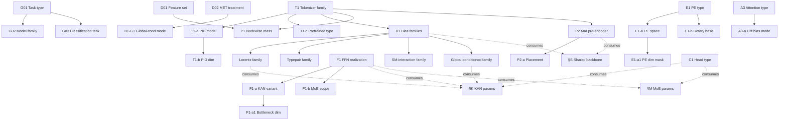

# Transformer-Classifier Design-Space Reference V2

**Authority order:**
1. Hydra config + implementation (source of truth)
2. `facts/axes.json` and W&B `axes/*` (canonical mirror)
3. W&B structured config keys and CSV exports
4. This document

---

## 0. Structure Overview

### 0.1 Hierarchy

```
G  — Study framing      (task, model family, classification target)
D  — Data treatment     (features, MET, token order)
T  — Tokenizer          (input representation → embedding)
E  — Positional encoding
P  — Pre-encoder modules (before transformer)
A  — Attention & encoder-block controls
F  — Encoder FFN realization
B  — Physics-informed attention biases (additive to logits)
C  — Classifier head    (pooled representation → class)
H  — Model-size hyperparameters
─────────────────────────────────────────────────────────
§K — KAN shared hyperparameters    (cross-cutting)
§M — MoE shared hyperparameters    (cross-cutting)
§S — Shared pairwise backbone       (cross-cutting infrastructure)
─────────────────────────────────────────────────────────
§R — Training protocol              (not architecture)
§L — Logging / interpretability     (not architecture)
```

### 0.2 Dependency Diagram



### 0.3 Key Rules

| Rule | Details |
|---|---|
| Raw-token path | `B1` bias families, `P1`, `P2`, `§S` require `T1 ∈ {raw, identity}`. Not available for `T1 = binned`. |
| Energy requirement | `P1` (nodewise mass) requires energy feature (`D01` includes index 0). |
| MET requirement | `B1-G1 = met_direction` requires `D02 = true`. |
| FFN mutual exclusivity | MoE > KAN > standard priority. One realization per encoder block. |
| MoE scope/head overlap | `moe.scope = head` → MoE in head only (zero encoder MoE blocks). |
| KAN shared coupling | `§K` (K1–K5) affects all active KAN modules simultaneously. |
| MoE shared coupling | `§M` (M1–M5) affects both encoder and head MoE when both active. |
| PID dim override | `T1-b` is overridden to `num_types` when `T1-a = one_hot`. |

---

## 1. G — Study Framing

These define the experimental conditions — **what is being classified and with which model type**. They are not architectural axes.

### G01 · Task Type

- **Config:** `loop`
- **W&B:** `model/loop`
- **Options:** `transformer_classifier` · `mlp_classifier` · `bdt_classifier` · `ae` · `gan_ae` · `diffusion_ae`
- **Default:** `transformer_classifier`
- **Note:** Selects the training loop via `DISPATCH` in `cli/train/__init__.py`.

### G02 · Model Family

- **Config:** derived from `loop`
- **W&B:** `model/type`
- **Options:** `transformer` · `mlp` · `bdt` · `autoencoder`
- **Default:** `transformer`
- **Note:** Inferred by `wandb_utils.extract_wandb_config`. Not directly configurable.

### G03 · Classification Task

- **Config:** `data.classifier.signal_vs_background`, `data.classifier.selected_labels`
- **W&B:** `meta.process_groups_key` (stable grouping key), `meta.class_def_str` (human-readable)
- **Options:** `4t-vs-bg` · `4t-vs-ttH` · multiclass · binary 1v1 (5-tops)
- **Default:** dataset-loader default
- **Note:** Derived canonical keys (`meta.row_key`, `meta.n_classes`) are also logged. See `facts/meta.py`.

---

## 2. D — Data Treatment

Input data conditioning applied before tokenization. These define **what the model sees**, not how it processes it.

### D01 · Feature Set

- **Config:** `data.cont_features`
- **axes key:** `cont_features`
- **W&B:** `axes/cont_features` · `data/cont_features`
- **Options:** `[0,1,2,3]` (E, pT, η, φ) · `[1,2,3]` (no energy)
- **Default:** dataset-loader default
- **Prerequisite:** None
- **Note:** Index 0 = energy. Required by `P1` (nodewise mass). Also captured as `meta.datatreatment_tokenization` and `meta.feature_mode`.

### D02 · MET Treatment

- **Config:** `classifier.globals.include_met`
- **axes key:** `include_met`
- **W&B:** `axes/include_met` · `globals/include_met`
- **Options:** `false` · `true`
- **Default:** `false`
- **Prerequisite:** None
- **Note:** When `true`, MET and METφ are available as globals/tokens. Required for `B1-G1 = met_direction`. Also captured as `meta.datatreatment_met_rep`.

### D03 · Token Ordering

- **Config:** `data.sort_tokens_by`, `data.shuffle_tokens`
- **axes key:** `token_order` (inferred: `input_order` · `pt_sorted` · `shuffled`)
- **W&B:** `axes/token_order` · `data/sort_tokens_by` · `data/shuffle_tokens`
- **Options:** `input_order` · `pt_sorted` · `shuffled`
- **Default:** `input_order`
- **Prerequisite:** None
- **Note:** Inferred in `facts/axes.py:_infer_token_order`. Also captured as `meta.datatreatment_token_order` and `data/token_order`.

---

## 3. Architecture Axes

The architecture axes are organised as a dependency tree with seven branches: **T** (tokenizer), **E** (positional encoding), **P** (pre-encoder modules), **A** (attention/block), **F** (FFN), **B** (physics biases), **C** (classifier head). Model-size knobs **H01–H10** sit under **H** (see below). Cross-cutting shared parameter blocks §K, §M, §S are documented in Section 4.

---

### T — Tokenizer

Converts raw particle features into token embeddings passed to the encoder.

#### T1 · Tokenizer Family

- **Config:** `classifier.model.tokenizer.name`
- **axes key:** `tokenizer_name`
- **W&B:** `axes/tokenizer_name` · `tokenizer/type`
- **Options:** `raw` · `identity` · `binned` · `pretrained`
- **Default:** `raw`
- **Prerequisite:** None

#### T1-a · PID Embedding Mode

- **Config:** `classifier.model.tokenizer.pid_mode`
- **axes key:** `pid_mode`
- **W&B:** `axes/pid_mode` · `tokenizer/pid_mode`
- **Options:** `learned` · `one_hot` · `fixed_random`
- **Default:** `learned`
- **Prerequisite:** T1 = `identity`

#### T1-b · PID Embedding Dimension

- **Config:** `classifier.model.tokenizer.id_embed_dim`
- **axes key:** `id_embed_dim`
- **W&B:** `axes/id_embed_dim` · `tokenizer/id_embed_dim`
- **Options:** `8` · `16` · `32`
- **Default:** `8`
- **Prerequisite:** T1 = `identity`. Overridden to `num_types` when T1-a = `one_hot`.
- **Note:** Also captured as `meta.datatreatment_id_embed_dim`.

#### T1-c · Pretrained Model Type

- **Config:** `classifier.model.tokenizer.model_type`
- **axes key:** —
- **W&B:** `tokenizer/model_type`
- **Options:** `vq` (+ checkpoint paths)
- **Default:** N/A
- **Prerequisite:** T1 = `pretrained`

---

### E — Positional Encoding

Controls how sequential/spatial position information is injected into the token stream.

#### E1 · PE Type

- **Config:** `classifier.model.positional`
- **axes key:** `positional`
- **W&B:** `axes/positional` · `pos_enc/type`
- **Options:** `none` · `sinusoidal` · `learned` · `rotary`
- **Default:** `sinusoidal`
- **Prerequisite:** None

#### E1-a · PE Space

- **Config:** `classifier.model.positional_space`
- **axes key:** `positional_space`
- **W&B:** `axes/positional_space` · `pos_enc/space`
- **Options:** `model` (after projection) · `token` (before projection)
- **Default:** `model`
- **Prerequisite:** E1 ∈ {`sinusoidal`, `learned`}

#### E1-a1 · PE Dimension Mask

- **Config:** `classifier.model.positional_dim_mask`
- **axes key:** `positional_dim_mask`
- **W&B:** `axes/positional_dim_mask` · `pos_enc/dim_mask`
- **Options:** `null` · `[id]` · `[E]` · `[Pt]` · `[phi]` · `[eta]` · `[continuous]` · `[phi,eta]` · preset configs in `configs/classifier/positional_dim_mask/`
- **Default:** `null` (all dims)
- **Prerequisite:** E1-a = `token`

#### E1-b · Rotary Base Frequency

- **Config:** `classifier.model.rotary.base`
- **axes key:** —
- **W&B:** `pos_enc/rotary_base`
- **Options:** float (default `10000.0`)
- **Default:** `10000.0`
- **Prerequisite:** E1 = `rotary`

---

### P — Pre-Encoder Modules

Modules applied to raw particle features **before** the main transformer encoder. All require `T1 ∈ {raw, identity}`.

#### P1 · Nodewise Mass Module

- **Config:** `classifier.model.nodewise_mass.enabled`
- **axes key:** `nodewise_mass_enabled`
- **W&B:** `axes/nodewise_mass_enabled` · `nodewise_mass/enabled`
- **Options:** `false` · `true`
- **Default:** `false`
- **Prerequisite:** D01 includes energy (index 0); T1 ∈ {`raw`, `identity`}

#### P1-a · Neighbourhood Sizes

- **Config:** `classifier.model.nodewise_mass.k_values`
- **axes key:** —
- **W&B:** `nodewise_mass/k_values`
- **Options:** list[int] (default `[2, 4, 8]`)
- **Prerequisite:** P1 = `true`

#### P1-b · Hidden Dimension

- **Config:** `classifier.model.nodewise_mass.hidden_dim`
- **axes key:** —
- **W&B:** `raw/classifier/model/nodewise_mass/hidden_dim`
- **Options:** int (default `64`)
- **Prerequisite:** P1 = `true`

#### P2 · MIA Pre-Encoder

- **Config:** `classifier.model.mia_blocks.enabled`
- **axes key:** `mia_enabled`
- **W&B:** `axes/mia_enabled` · `mia/enabled`
- **Options:** `false` · `true`
- **Default:** `false`
- **Prerequisite:** T1 ∈ {`raw`, `identity`}; consumes §S (shared backbone)

#### P2-a · MIA Placement

- **Config:** `classifier.model.mia_blocks.placement`
- **axes key:** `mia_placement`
- **W&B:** `axes/mia_placement` · `mia/placement`
- **Options:** `prepend` · `append` (`interleave` accepted but falls back to `prepend`)
- **Default:** `prepend`
- **Prerequisite:** P2 = `true`

#### P2-b · MIA Number of Blocks

- **Config:** `classifier.model.mia_blocks.num_blocks`
- **axes key:** —
- **W&B:** `mia/num_blocks`
- **Options:** int (default `5`)
- **Prerequisite:** P2 = `true`

#### P2-c · MIA Interaction Dimension

- **Config:** `classifier.model.mia_blocks.interaction_dim`
- **axes key:** —
- **W&B:** `raw/classifier/model/mia_blocks/interaction_dim`
- **Options:** int (default `64`)
- **Prerequisite:** P2 = `true`

#### P2-d · MIA Reduction Dimension

- **Config:** `classifier.model.mia_blocks.reduction_dim`
- **axes key:** —
- **W&B:** `raw/classifier/model/mia_blocks/reduction_dim`
- **Options:** int (default `8` = num_heads)
- **Prerequisite:** P2 = `true`

#### P2-e · MIA Dropout

- **Config:** `classifier.model.mia_blocks.dropout`
- **axes key:** —
- **W&B:** `raw/classifier/model/mia_blocks/dropout`
- **Options:** float (default `0.0`)
- **Prerequisite:** P2 = `true`

---

### A — Attention & Encoder-Block Controls

Controls the transformer encoder's internal computation. These axes apply to **every** encoder block.

#### A1 · Normalization Policy

- **Config:** `classifier.model.norm.policy`
- **axes key:** `norm_policy`
- **W&B:** `axes/norm_policy` · `norm/policy`
- **Options:** `pre` · `post` · `normformer`
- **Default:** `pre`
- **Prerequisite:** None

#### A2 · Normalization Type

- **Config:** `classifier.model.norm.type`
- **axes key:** `norm_type`
- **W&B:** `axes/norm_type` · `norm/type`
- **Options:** `layernorm` · `rmsnorm`
- **Default:** `layernorm`
- **Prerequisite:** None

#### A3 · Attention Type

- **Config:** `classifier.model.attention.type`
- **axes key:** `attention_type`
- **W&B:** `axes/attention_type` · `attention/type`
- **Options:** `standard` · `differential`
- **Default:** `standard`
- **Prerequisite:** None

#### A3-a · Differential Attention Bias Mode

- **Config:** `classifier.model.attention.diff_bias_mode`
- **axes key:** `diff_bias_mode`
- **W&B:** `axes/diff_bias_mode` · `attention/diff_bias_mode`
- **Options:** `none` · `shared` · `split`
- **Default:** `shared`
- **Prerequisite:** A3 = `differential`
- **Note:** Controls how additive physics bias (B1) interacts with the two differential-attention branches.

#### A4 · Attention-Internal Normalization

- **Config:** `classifier.model.attention.norm`
- **axes key:** `attention_norm`
- **W&B:** `axes/attention_norm` · `attention/norm`
- **Options:** `none` · `layernorm` · `rmsnorm`
- **Default:** `none`
- **Prerequisite:** None; applies to both standard and differential attention.

#### A5 · Pooling Strategy

- **Config:** `classifier.model.head.pooling`
- **axes key:** `pooling`
- **W&B:** `axes/pooling` · `pooling/type`
- **Options:** `cls` · `mean` · `max`
- **Default:** `cls`
- **Prerequisite:** None

#### A6 · Causal Masking

- **Config:** `classifier.model.causal_attention`
- **axes key:** `causal_attention`
- **W&B:** `axes/causal_attention` · `model/causal_attention`
- **Options:** `false` · `true`
- **Default:** `false`
- **Prerequisite:** None

---

### F — Encoder FFN Realization

Controls the feed-forward network inside each encoder block. The effective realization follows a priority rule: **MoE > KAN > standard**.

#### F1 · Encoder FFN Realization

- **Config:** `classifier.model.ffn.type` (for `kan`), `classifier.model.moe.enabled` (for `moe`)
- **axes keys:** `ffn_type`, `moe_enabled`
- **W&B:** `axes/ffn_type` · `ffn/type` · `axes/moe_enabled` · `moe/enabled`
- **Options (effective):** `standard` · `kan` · `moe`
- **Default:** `standard` (ffn.type=standard, moe.enabled=false)
- **Note:** Code priority: `moe.enabled=true` → MoEFFN; `ffn.type=kan` → KANFFN; else → StandardFFN. Capacity of the standard FFN set by H04 (`mlp_dim`).

#### F1-a · KAN FFN Variant

- **Config:** `classifier.model.ffn.kan.variant`
- **axes key:** `kan_ffn_variant`
- **W&B:** `axes/kan_ffn_variant` · `ffn/kan_variant`
- **Options:** `hybrid` · `bottleneck` · `pure`
- **Default:** `hybrid`
- **Prerequisite:** F1 effective = `kan`; consumes §K (shared KAN params)

#### F1-a1 · KAN FFN Bottleneck Dimension

- **Config:** `classifier.model.ffn.kan.bottleneck_dim`
- **axes key:** —
- **W&B:** `raw/classifier/model/ffn/kan/bottleneck_dim`
- **Options:** int or `null` (default = `mlp_dim // 4`)
- **Prerequisite:** F1-a = `bottleneck`

#### F1-b · MoE Encoder Scope

- **Config:** `classifier.model.moe.scope`
- **axes key:** `moe_scope`
- **W&B:** `axes/moe_scope` · `moe/scope`
- **Options:** `all_blocks` · `middle_blocks` · `head` (head-only → zero encoder MoE blocks)
- **Default:** `all_blocks`
- **Prerequisite:** F1 effective = `moe`; consumes §M (shared MoE params)

---

### B — Physics-Informed Attention Biases

Additive bias terms injected into attention logits. Requires `T1 ∈ {raw, identity}`. Consumes §S (shared pairwise backbone) for all families.

**B1 is a combinatorial activation set** — multiple families can be active simultaneously using `+` notation (e.g. `"lorentz_scalar+typepair_kinematic"`).

#### B1 · Bias Activation Set

- **Config:** `classifier.model.attention_biases`
- **axes key:** `attention_biases`
- **W&B:** `axes/attention_biases` · `bias/selector`
- **Options:** `none` · `lorentz_scalar` · `sm_interaction` · `typepair_kinematic` · `global_conditioned` · `+` combinations
- **Default:** `none`
- **Prerequisite:** T1 ∈ {`raw`, `identity`}

---

#### B1-L — Lorentz-Scalar Family · active when `"lorentz_scalar" ∈ B1`

##### B1-L1 · Lorentz Feature Set

- **Config:** `classifier.model.bias_config.lorentz_scalar.features`
- **axes key:** `lorentz_features`
- **W&B:** `axes/lorentz_features` · `bias/lorentz_features`
- **Options:** subsets of `[m2, dot, log_m2, log_kt, z, deltaR, deltaR_ptw]`
- **Default:** `[m2, deltaR]`

##### B1-L2 · Lorentz MLP Type

- **Config:** `classifier.model.bias_config.lorentz_scalar.mlp_type`
- **axes key:** `lorentz_mlp_type`
- **W&B:** `axes/lorentz_mlp_type` · `kan/bias_lorentz_mlp_type`
- **Options:** `standard` · `kan` (consumes §K when `kan`)
- **Default:** `standard`

##### B1-L3 · Lorentz Hidden Dimension

- **Config:** `classifier.model.bias_config.lorentz_scalar.hidden_dim`
- **axes key:** —
- **W&B:** `raw/classifier/model/bias_config/lorentz_scalar/hidden_dim`
- **Options:** int (default `8`)

##### B1-L4 · Lorentz Per-Head Mode

- **Config:** `classifier.model.bias_config.lorentz_scalar.per_head`
- **axes key:** `lorentz_per_head`
- **W&B:** `axes/lorentz_per_head` · `bias/lorentz_per_head`
- **Options:** `false` · `true`
- **Default:** `false`

##### B1-L5 · Lorentz Sparse Gating

- **Config:** `classifier.model.bias_config.lorentz_scalar.sparse_gating`
- **axes key:** `lorentz_sparse_gating`
- **W&B:** `axes/lorentz_sparse_gating` · `bias/lorentz_sparse_gating`
- **Options:** `false` · `true`
- **Default:** `false`

---

#### B1-T — Type-Pair Kinematic Family · active when `"typepair_kinematic" ∈ B1`

##### B1-T1 · Type-Pair Initialization

- **Config:** `classifier.model.bias_config.typepair_kinematic.init_from_physics`
- **axes key:** `typepair_init`
- **W&B:** `axes/typepair_init` · `bias/typepair_init`
- **Options:** `none` · `binary` · `fixed_coupling`
- **Default:** `none`

##### B1-T2 · Type-Pair Freeze Table

- **Config:** `classifier.model.bias_config.typepair_kinematic.freeze_table`
- **axes key:** `typepair_freeze`
- **W&B:** `axes/typepair_freeze` · `bias/typepair_freeze`
- **Options:** `false` · `true`
- **Default:** `false`

##### B1-T3 · Type-Pair Kinematic Gate

- **Config:** `classifier.model.bias_config.typepair_kinematic.kinematic_gate`
- **axes key:** `typepair_kinematic_gate`
- **W&B:** `axes/typepair_kinematic_gate` · `bias/typepair_kinematic_gate`
- **Options:** `true` · `false`
- **Default:** `true`

##### B1-T4 · Type-Pair Kinematic Feature

- **Config:** `classifier.model.bias_config.typepair_kinematic.kinematic_feature`
- **axes key:** —
- **W&B:** `raw/classifier/model/bias_config/typepair_kinematic/kinematic_feature`
- **Options:** one of `VALID_FEATURES` (default `log_m2`)

##### B1-T5 · Type-Pair Mask Value

- **Config:** `classifier.model.bias_config.typepair_kinematic.mask_value`
- **axes key:** —
- **W&B:** `raw/classifier/model/bias_config/typepair_kinematic/mask_value`
- **Options:** float (default `-5.0`)

---

#### B1-S — SM-Interaction Family · active when `"sm_interaction" ∈ B1`

##### B1-S1 · SM Interaction Mode

- **Config:** `classifier.model.bias_config.sm_interaction.mode`
- **axes key:** `sm_mode`
- **W&B:** `axes/sm_mode` · `bias/sm_mode`
- **Options:** `binary` · `fixed_coupling` · `running_coupling`
- **Default:** `binary`

##### B1-S2 · SM Mask Value

- **Config:** `classifier.model.bias_config.sm_interaction.mask_value`
- **axes key:** —
- **W&B:** `raw/classifier/model/bias_config/sm_interaction/mask_value`
- **Options:** float (default `-100.0`)

---

#### B1-G — Global-Conditioned Family · active when `"global_conditioned" ∈ B1`

##### B1-G1 · Global-Conditioned Mode

- **Config:** `classifier.model.bias_config.global_conditioned.mode`
- **axes key:** `global_conditioned_mode`
- **W&B:** `axes/global_conditioned_mode` · `bias/global_mode`
- **Options:** `global_scale` · `met_direction`
- **Default:** `global_scale`
- **Prerequisite:** `met_direction` requires D02 = `true`

##### B1-G2 · Global-Conditioned MLP Type

- **Config:** `classifier.model.bias_config.global_conditioned.mlp_type`
- **axes key:** —
- **W&B:** `kan/bias_global_mlp_type`
- **Options:** `standard` · `kan` (consumes §K when `kan`)
- **Default:** `standard`

##### B1-G3 · Global-Conditioned Global Dimension

- **Config:** `classifier.model.bias_config.global_conditioned.global_dim`
- **axes key:** —
- **W&B:** `raw/classifier/model/bias_config/global_conditioned/global_dim`
- **Options:** int (default `16`)

---

### C — Classifier Head

Maps the pooled event representation to class logits.

#### C1 · Head Realization

- **Config:** `classifier.model.head.type`
- **axes key:** `head_type`
- **W&B:** `axes/head_type` · `head/type`
- **Options:** `linear` · `kan` (consumes §K) · `moe` (consumes §M)
- **Default:** `linear`
- **Note:** `head.type = moe` and `moe.enabled = true` with `moe.scope = head` are code-equivalent — both activate a MoE classifier head.

---

### H — Model-Size Hyperparameters

Not architectural axes but required for model definition. Logged as `axes/*` keys.

| ID | Name | Config | axes key | W&B |
|---|---|---|---|---|
| H01 | Model dimension | `classifier.model.dim` | `dim` | `model/dim` |
| H02 | Encoder depth | `classifier.model.depth` | `depth` | `model/depth` |
| H03 | Attention heads | `classifier.model.heads` | `heads` | `model/heads` |
| H04 | FFN hidden dim | `classifier.model.mlp_dim` | `mlp_dim` | `model/mlp_dim` |
| H05 | Dropout | `classifier.model.dropout` | `dropout` | `model/dropout` |
| H10 | Model size label | derived `d{dim}_L{depth}` | `model_size_key` | `model/size_key` |

---

## 4. Shared Modules (§K, §M, §S)

These are **not independent axes** — they are cross-cutting parameter blocks consumed by multiple modules simultaneously. Changing any of their settings affects all active consumers at once.

### §K — KAN Shared Hyperparameters

Consumed by every active KAN module: encoder FFN (`F1=kan`), classifier head (`C1=kan`), Lorentz MLP (`B1-L2=kan`), global-conditioned MLP (`B1-G2=kan`).

| ID | Name | Config | axes key | W&B |
|---|---|---|---|---|
| K1 | Grid size | `classifier.model.kan.grid_size` | `kan_grid_size` | `kan/grid_size` |
| K2 | Spline order | `classifier.model.kan.spline_order` | `kan_spline_order` | `kan/spline_order` |
| K3 | Grid range | `classifier.model.kan.grid_range` | — | `kan/grid_range` |
| K4 | Spline regularization weight | `classifier.model.kan.spline_regularization_weight` | — | `kan/spline_reg_weight` |
| K5 | Grid update frequency | `classifier.model.kan.grid_update_freq` | — | `kan/grid_update_freq` |

### §M — MoE Shared Hyperparameters

Consumed when MoE is active in encoder FFNs (`F1=moe`) and/or the classifier head (`C1=moe`). One shared `classifier.model.moe.*` config block applies to both sites.

| ID | Name | Config | axes key | W&B |
|---|---|---|---|---|
| M1 | Number of experts | `classifier.model.moe.num_experts` | — | `moe/num_experts` |
| M2 | Top-k | `classifier.model.moe.top_k` | `moe_top_k` | `axes/moe_top_k` · `moe/top_k` |
| M3 | Routing level | `classifier.model.moe.routing_level` | `moe_routing_level` | `axes/moe_routing_level` · `moe/routing_level` |
| M4 | Load-balance weight | `classifier.model.moe.load_balance_loss_weight` | — | `moe/lb_weight` |
| M5 | Noisy gating | `classifier.model.moe.noisy_gating` | — | `moe/noisy_gating` |

### §S — Shared Pairwise Backbone

Computes `F_ij [B, T, T, F]` once per forward pass. Consumed by all B1 bias families and the MIA pre-encoder (P2). Only active when at least one bias family or P2 is enabled.

| ID | Name | Config | axes key | W&B |
|---|---|---|---|---|
| S1 | Backbone enabled | `classifier.model.shared_backbone.enabled` | — | `raw/classifier/model/shared_backbone/enabled` |
| S2 | Feature selection | `classifier.model.shared_backbone.features` | — | `raw/classifier/model/shared_backbone/features` |

---

## 5. §R — Training Protocol

These define **how the model is optimised**, not what it is. Included for W&B traceability and CSV completeness.

### Core Training

| ID | Name | Config | axes key | W&B |
|---|---|---|---|---|
| R01 | Epochs | `classifier.trainer.epochs` | `epochs` | `axes/epochs` · `training/epochs` |
| R02 | Learning rate | `classifier.trainer.lr` | `lr` | `axes/lr` · `training/lr` |
| R03 | Weight decay | `classifier.trainer.weight_decay` | `weight_decay` | `axes/weight_decay` · `training/weight_decay` |
| R04 | Batch size | `classifier.trainer.batch_size` | `batch_size` | `axes/batch_size` · `training/batch_size` |
| R05 | Seed | `classifier.trainer.seed` | `seed` | `axes/seed` · `training/seed` |

### Optimization Schedule

| ID | Name | Config | axes key | W&B |
|---|---|---|---|---|
| R06 | Warmup steps | `classifier.trainer.warmup_steps` | — | `training/warmup_steps` |
| R07 | LR schedule | `classifier.trainer.lr_schedule` | — | `training/lr_schedule` |
| R08 | Label smoothing | `classifier.trainer.label_smoothing` | — | `training/label_smoothing` |
| R09 | Gradient clipping | `classifier.trainer.grad_clip` | — | `training/grad_clip` |

### Early Stopping

| ID | Name | Config | axes key | W&B |
|---|---|---|---|---|
| R10 | Enabled | `classifier.trainer.early_stopping.enabled` | — | `early_stop/enabled` |
| R11 | Patience | `classifier.trainer.early_stopping.patience` | — | `early_stop/patience` |
| R12 | Min delta | `classifier.trainer.early_stopping.min_delta` | — | `raw/...` |
| R13 | Restore best weights | `classifier.trainer.early_stopping.restore_best_weights` | — | `raw/...` |

### PID Training Schedule

Only meaningful when T1 = `identity` with T1-a = `learned`.

| ID | Name | Config | axes key | W&B |
|---|---|---|---|---|
| R14 | PID schedule mode | `classifier.trainer.pid_schedule.mode` | — | `pid/schedule_mode` |
| R15 | Transition epoch | `classifier.trainer.pid_schedule.transition_epoch` | — | `pid/transition_epoch` |
| R16 | Reinit mode | `classifier.trainer.pid_schedule.reinit_mode` | — | `raw/...` |
| R17 | PID separate LR | `classifier.trainer.pid_schedule.pid_lr` | — | `raw/...` |

---

## 6. Master Axes Table

Complete mapping of all axes. `axes/*` keys are written to `facts/axes.json` and mirrored to W&B as `axes/<key>`. The `Also logged as` column shows structured W&B keys from `wandb_utils.py`.

### 6.1 Goal & Data

| ID | Name | Group | Hydra Config Key | axes key | W&B (axes/) | Also logged as | Depends On |
|---|---|---|---|---|---|---|---|
| G01 | Task type | G | `loop` | `experiment_name`* | — | `model/loop` | — |
| G02 | Model family | G | derived | — | — | `model/type` | G01 |
| G03 | Classification task | G | `data.classifier.signal_vs_background`, `data.classifier.selected_labels` | — | — | `meta.process_groups_key`, `meta.class_def_str` | — |
| D01 | Feature set | D | `data.cont_features` | `cont_features` | `axes/cont_features` | `data/cont_features` | — |
| D02 | MET treatment | D | `classifier.globals.include_met` | `include_met` | `axes/include_met` | `globals/include_met` | — |
| D03 | Token ordering | D | `data.sort_tokens_by`, `data.shuffle_tokens` | `token_order` | `axes/token_order` | `data/sort_tokens_by`, `data/shuffle_tokens`, `data/token_order` | — |

*`experiment_name` is written in `axes.json` if present in config.

### 6.2 Tokenizer (T)

| ID | Name | Hydra Config Key | axes key | W&B (axes/) | Also logged as | Depends On |
|---|---|---|---|---|---|---|
| T1 | Tokenizer family | `classifier.model.tokenizer.name` | `tokenizer_name` | `axes/tokenizer_name` | `tokenizer/type` | — |
| T1-a | PID embedding mode | `classifier.model.tokenizer.pid_mode` | `pid_mode` | `axes/pid_mode` | `tokenizer/pid_mode` | T1 = identity |
| T1-b | PID embedding dimension | `classifier.model.tokenizer.id_embed_dim` | `id_embed_dim` | `axes/id_embed_dim` | `tokenizer/id_embed_dim` | T1 = identity |
| T1-c | Pretrained model type | `classifier.model.tokenizer.model_type` | — | — | `tokenizer/model_type` | T1 = pretrained |

### 6.3 Positional Encoding (E)

| ID | Name | Hydra Config Key | axes key | W&B (axes/) | Also logged as | Depends On |
|---|---|---|---|---|---|---|
| E1 | PE type | `classifier.model.positional` | `positional` | `axes/positional` | `pos_enc/type` | — |
| E1-a | PE space | `classifier.model.positional_space` | `positional_space` | `axes/positional_space` | `pos_enc/space` | E1 ∈ {sin, learned} |
| E1-a1 | PE dimension mask | `classifier.model.positional_dim_mask` | `positional_dim_mask` | `axes/positional_dim_mask` | `pos_enc/dim_mask` | E1-a = token |
| E1-b | Rotary base frequency | `classifier.model.rotary.base` | — | — | `pos_enc/rotary_base` | E1 = rotary |

### 6.4 Pre-Encoder Modules (P)

| ID | Name | Hydra Config Key | axes key | W&B (axes/) | Also logged as | Depends On |
|---|---|---|---|---|---|---|
| P1 | Nodewise mass enabled | `classifier.model.nodewise_mass.enabled` | `nodewise_mass_enabled` | `axes/nodewise_mass_enabled` | `nodewise_mass/enabled` | D01 has energy, T1 ∈ {raw, identity} |
| P1-a | Neighbourhood sizes | `classifier.model.nodewise_mass.k_values` | — | — | `nodewise_mass/k_values` | P1 = true |
| P1-b | Hidden dimension | `classifier.model.nodewise_mass.hidden_dim` | — | — | `raw/*` | P1 = true |
| P2 | MIA pre-encoder enabled | `classifier.model.mia_blocks.enabled` | `mia_enabled` | `axes/mia_enabled` | `mia/enabled` | T1 ∈ {raw, identity} |
| P2-a | MIA placement | `classifier.model.mia_blocks.placement` | `mia_placement` | `axes/mia_placement` | `mia/placement` | P2 = true |
| P2-b | MIA number of blocks | `classifier.model.mia_blocks.num_blocks` | — | — | `mia/num_blocks` | P2 = true |
| P2-c | MIA interaction dimension | `classifier.model.mia_blocks.interaction_dim` | — | — | `raw/*` | P2 = true |
| P2-d | MIA reduction dimension | `classifier.model.mia_blocks.reduction_dim` | — | — | `raw/*` | P2 = true |
| P2-e | MIA dropout | `classifier.model.mia_blocks.dropout` | — | — | `raw/*` | P2 = true |

### 6.5 Attention & Encoder Block (A)

| ID | Name | Hydra Config Key | axes key | W&B (axes/) | Also logged as | Depends On |
|---|---|---|---|---|---|---|
| A1 | Normalization policy | `classifier.model.norm.policy` | `norm_policy` | `axes/norm_policy` | `norm/policy` | — |
| A2 | Normalization type | `classifier.model.norm.type` | `norm_type` | `axes/norm_type` | `norm/type` | — |
| A3 | Attention type | `classifier.model.attention.type` | `attention_type` | `axes/attention_type` | `attention/type` | — |
| A3-a | Differential attention bias mode | `classifier.model.attention.diff_bias_mode` | `diff_bias_mode` | `axes/diff_bias_mode` | `attention/diff_bias_mode` | A3 = differential |
| A4 | Attention-internal normalization | `classifier.model.attention.norm` | `attention_norm` | `axes/attention_norm` | `attention/norm` | — |
| A5 | Pooling strategy | `classifier.model.head.pooling` | `pooling` | `axes/pooling` | `pooling/type` | — |
| A6 | Causal masking | `classifier.model.causal_attention` | `causal_attention` | `axes/causal_attention` | `model/causal_attention` | — |

### 6.6 Encoder FFN (F)

| ID | Name | Hydra Config Key | axes key | W&B (axes/) | Also logged as | Depends On |
|---|---|---|---|---|---|---|
| F1 | FFN realization (effective) | `classifier.model.ffn.type`, `classifier.model.moe.enabled` | `ffn_type`, `moe_enabled` | `axes/ffn_type`, `axes/moe_enabled` | `ffn/type`, `moe/enabled` | — |
| F1-a | KAN FFN variant | `classifier.model.ffn.kan.variant` | `kan_ffn_variant` | `axes/kan_ffn_variant` | `ffn/kan_variant` | F1 = kan |
| F1-a1 | KAN FFN bottleneck dim | `classifier.model.ffn.kan.bottleneck_dim` | — | — | `raw/*` | F1-a = bottleneck |
| F1-b | MoE encoder scope | `classifier.model.moe.scope` | `moe_scope` | `axes/moe_scope` | `moe/scope` | F1 = moe |

### 6.7 Physics Biases (B)

| ID | Name | Hydra Config Key | axes key | W&B (axes/) | Also logged as | Depends On |
|---|---|---|---|---|---|---|
| B1 | Bias activation set | `classifier.model.attention_biases` | `attention_biases` | `axes/attention_biases` | `bias/selector` | T1 ∈ {raw, identity} |
| B1-L1 | Lorentz feature set | `classifier.model.bias_config.lorentz_scalar.features` | `lorentz_features` | `axes/lorentz_features` | `bias/lorentz_features` | lorentz_scalar ∈ B1 |
| B1-L2 | Lorentz MLP type | `classifier.model.bias_config.lorentz_scalar.mlp_type` | `lorentz_mlp_type` | `axes/lorentz_mlp_type` | `kan/bias_lorentz_mlp_type` | lorentz_scalar ∈ B1 |
| B1-L3 | Lorentz hidden dimension | `classifier.model.bias_config.lorentz_scalar.hidden_dim` | — | — | `raw/*` | lorentz_scalar ∈ B1 |
| B1-L4 | Lorentz per-head mode | `classifier.model.bias_config.lorentz_scalar.per_head` | `lorentz_per_head` | `axes/lorentz_per_head` | `bias/lorentz_per_head` | lorentz_scalar ∈ B1 |
| B1-L5 | Lorentz sparse gating | `classifier.model.bias_config.lorentz_scalar.sparse_gating` | `lorentz_sparse_gating` | `axes/lorentz_sparse_gating` | `bias/lorentz_sparse_gating` | lorentz_scalar ∈ B1 |
| B1-T1 | Type-pair initialization | `classifier.model.bias_config.typepair_kinematic.init_from_physics` | `typepair_init` | `axes/typepair_init` | `bias/typepair_init` | typepair_kinematic ∈ B1 |
| B1-T2 | Type-pair freeze table | `classifier.model.bias_config.typepair_kinematic.freeze_table` | `typepair_freeze` | `axes/typepair_freeze` | `bias/typepair_freeze` | typepair_kinematic ∈ B1 |
| B1-T3 | Type-pair kinematic gate | `classifier.model.bias_config.typepair_kinematic.kinematic_gate` | `typepair_kinematic_gate` | `axes/typepair_kinematic_gate` | `bias/typepair_kinematic_gate` | typepair_kinematic ∈ B1 |
| B1-T4 | Type-pair kinematic feature | `classifier.model.bias_config.typepair_kinematic.kinematic_feature` | — | — | `raw/*` | typepair_kinematic ∈ B1 |
| B1-T5 | Type-pair mask value | `classifier.model.bias_config.typepair_kinematic.mask_value` | — | — | `raw/*` | typepair_kinematic ∈ B1 |
| B1-S1 | SM interaction mode | `classifier.model.bias_config.sm_interaction.mode` | `sm_mode` | `axes/sm_mode` | `bias/sm_mode` | sm_interaction ∈ B1 |
| B1-S2 | SM mask value | `classifier.model.bias_config.sm_interaction.mask_value` | — | — | `raw/*` | sm_interaction ∈ B1 |
| B1-G1 | Global-conditioned mode | `classifier.model.bias_config.global_conditioned.mode` | `global_conditioned_mode` | `axes/global_conditioned_mode` | `bias/global_mode` | global_conditioned ∈ B1 |
| B1-G2 | Global-conditioned MLP type | `classifier.model.bias_config.global_conditioned.mlp_type` | — | — | `kan/bias_global_mlp_type` | global_conditioned ∈ B1 |
| B1-G3 | Global-conditioned global dim | `classifier.model.bias_config.global_conditioned.global_dim` | — | — | `raw/*` | global_conditioned ∈ B1 |

### 6.8 Classifier Head (C)

| ID | Name | Hydra Config Key | axes key | W&B (axes/) | Also logged as | Depends On |
|---|---|---|---|---|---|---|
| C1 | Head realization | `classifier.model.head.type` | `head_type` | `axes/head_type` | `head/type` | — |

### 6.9 Shared Modules (§K, §M, §S)

| ID | Name | Hydra Config Key | axes key | W&B | Consumed By |
|---|---|---|---|---|---|
| K1 | KAN grid size | `classifier.model.kan.grid_size` | `kan_grid_size` | `axes/kan_grid_size` · `kan/grid_size` | F1=kan, C1=kan, B1-L2=kan, B1-G2=kan |
| K2 | KAN spline order | `classifier.model.kan.spline_order` | `kan_spline_order` | `axes/kan_spline_order` · `kan/spline_order` | same as K1 |
| K3 | KAN grid range | `classifier.model.kan.grid_range` | — | `kan/grid_range` | same as K1 |
| K4 | KAN spline reg weight | `classifier.model.kan.spline_regularization_weight` | — | `kan/spline_reg_weight` | same as K1 |
| K5 | KAN grid update freq | `classifier.model.kan.grid_update_freq` | — | `kan/grid_update_freq` | same as K1 |
| M1 | MoE num experts | `classifier.model.moe.num_experts` | — | `moe/num_experts` | F1=moe, C1=moe |
| M2 | MoE top-k | `classifier.model.moe.top_k` | `moe_top_k` | `axes/moe_top_k` · `moe/top_k` | F1=moe, C1=moe |
| M3 | MoE routing level | `classifier.model.moe.routing_level` | `moe_routing_level` | `axes/moe_routing_level` · `moe/routing_level` | F1=moe, C1=moe |
| M4 | MoE load-balance weight | `classifier.model.moe.load_balance_loss_weight` | — | `moe/lb_weight` | F1=moe, C1=moe |
| M5 | MoE noisy gating | `classifier.model.moe.noisy_gating` | — | `moe/noisy_gating` | F1=moe, C1=moe |
| S1 | Shared backbone enabled | `classifier.model.shared_backbone.enabled` | — | `raw/*` | B1 (any family), P2 |
| S2 | Shared backbone features | `classifier.model.shared_backbone.features` | — | `raw/*` | B1 (any family), P2 |

### 6.10 Model-Size Hyperparameters (H)

| ID | Name | Hydra Config Key | axes key | W&B (axes/) | Also logged as |
|---|---|---|---|---|---|
| H01 | Model dimension | `classifier.model.dim` | `dim` | `axes/dim` | `model/dim` |
| H02 | Encoder depth | `classifier.model.depth` | `depth` | `axes/depth` | `model/depth` |
| H03 | Attention heads | `classifier.model.heads` | `heads` | `axes/heads` | `model/heads` |
| H04 | FFN hidden dim | `classifier.model.mlp_dim` | `mlp_dim` | `axes/mlp_dim` | `model/mlp_dim` |
| H05 | Dropout | `classifier.model.dropout` | `dropout` | `axes/dropout` | `model/dropout` |
| H10 | Model size label | derived `d{dim}_L{depth}` | `model_size_key` | `axes/model_size_key` | `model/size_key` |

### 6.11 Training Protocol (§R)

| ID | Name | Hydra Config Key | axes key | W&B |
|---|---|---|---|---|
| R01 | Epochs | `classifier.trainer.epochs` | `epochs` | `axes/epochs` · `training/epochs` |
| R02 | Learning rate | `classifier.trainer.lr` | `lr` | `axes/lr` · `training/lr` |
| R03 | Weight decay | `classifier.trainer.weight_decay` | `weight_decay` | `axes/weight_decay` · `training/weight_decay` |
| R04 | Batch size | `classifier.trainer.batch_size` | `batch_size` | `axes/batch_size` · `training/batch_size` |
| R05 | Seed | `classifier.trainer.seed` | `seed` | `axes/seed` · `training/seed` |
| R06 | Warmup steps | `classifier.trainer.warmup_steps` | — | `training/warmup_steps` |
| R07 | LR schedule | `classifier.trainer.lr_schedule` | — | `training/lr_schedule` |
| R08 | Label smoothing | `classifier.trainer.label_smoothing` | — | `training/label_smoothing` |
| R09 | Gradient clipping | `classifier.trainer.grad_clip` | — | `training/grad_clip` |
| R10 | Early stop enabled | `classifier.trainer.early_stopping.enabled` | — | `early_stop/enabled` |
| R11 | Early stop patience | `classifier.trainer.early_stopping.patience` | — | `early_stop/patience` |
| R12 | Early stop min delta | `classifier.trainer.early_stopping.min_delta` | — | `raw/*` |
| R13 | Restore best weights | `classifier.trainer.early_stopping.restore_best_weights` | — | `raw/*` |
| R14 | PID schedule mode | `classifier.trainer.pid_schedule.mode` | — | `pid/schedule_mode` |
| R15 | PID transition epoch | `classifier.trainer.pid_schedule.transition_epoch` | — | `pid/transition_epoch` |
| R16 | PID reinit mode | `classifier.trainer.pid_schedule.reinit_mode` | — | `raw/*` |
| R17 | PID separate LR | `classifier.trainer.pid_schedule.pid_lr` | — | `raw/*` |

### 6.12 Logging & Interpretability (§L)

| ID | Name | Hydra Config Key | W&B |
|---|---|---|---|
| L1 | Log PID embeddings | `classifier.trainer.log_pid_embeddings` | `raw/*` |
| L2 | Interpretability enabled | `classifier.trainer.interpretability.enabled` | `raw/*` |
| L3 | Save attention maps | `classifier.trainer.interpretability.save_attention_maps` | `raw/*` |
| L4 | Save KAN splines | `classifier.trainer.interpretability.save_kan_splines` | `raw/*` |
| L5 | Save MoE routing | `classifier.trainer.interpretability.save_moe_routing` | `raw/*` |
| L6 | Save gradient norms | `classifier.trainer.interpretability.save_gradient_norms` | `raw/*` |
| L7 | Checkpoint epochs | `classifier.trainer.interpretability.checkpoint_epochs` | `raw/*` |

---

## 7. Statistics

| Category | Count |
|---|---|
| Study framing (G) | 3 primary choices |
| Data treatment (D) | 3 axes |
| Architecture primary choices | 12 (T1, E1, P1, P2, A1–A6, F1, B1, C1) |
| Architecture conditional sub-axes | 16 |
| Architecture module internals | 22 |
| Cross-cutting shared controls | 12 (§K×5, §M×5, §S×2) |
| Model-size hyperparameters | 6 (H01–H05, H10) |
| Training protocol (§R) | 17 |
| Logging (§L) | 7 |
| **Grand total configurable dimensions** | **~90** |

**Structural note:** B1 is a combinatorial activation set (not a selector), §K/§M/§S are cross-cutting shared blocks (not tree nodes), and 10 applicability constraints restrict valid combinations. This is a **dependency tree with activation sets** — not a fully orthogonal parameter space.

---

## 8. W&B CSV Completeness Checklist

### Must-Have (thesis CSV)

Every run that goes into thesis results should export these:

```
axes/tokenizer_name     axes/pid_mode            axes/id_embed_dim
axes/cont_features      axes/include_met          axes/token_order
axes/positional         axes/positional_space     axes/positional_dim_mask
axes/norm_policy        axes/norm_type
axes/attention_type     axes/attention_norm       axes/diff_bias_mode
axes/pooling            axes/causal_attention
axes/ffn_type           axes/kan_ffn_variant
axes/head_type
axes/moe_enabled        axes/moe_top_k            axes/moe_routing_level   axes/moe_scope
axes/attention_biases
axes/sm_mode            axes/lorentz_features     axes/lorentz_mlp_type
axes/lorentz_per_head   axes/lorentz_sparse_gating
axes/typepair_init      axes/typepair_freeze      axes/typepair_kinematic_gate
axes/global_conditioned_mode
axes/nodewise_mass_enabled  axes/mia_enabled      axes/mia_placement
axes/dim  axes/depth  axes/heads  axes/mlp_dim  axes/dropout
axes/lr   axes/weight_decay  axes/batch_size  axes/epochs  axes/seed
axes/model_size_key
meta.process_groups_key  meta.class_def_str  meta.row_key
training/epochs  training/warmup_steps  training/lr_schedule
training/label_smoothing  training/grad_clip
early_stop/enabled  early_stop/patience
```

### Nice-to-Have

```
pos_enc/rotary_base      pid/schedule_mode        pid/transition_epoch
kan/grid_size            kan/spline_order         kan/grid_range
kan/spline_reg_weight    kan/grid_update_freq
moe/num_experts          moe/lb_weight            moe/noisy_gating
nodewise_mass/k_values   mia/num_blocks
meta.datatreatment_tokenization  meta.datatreatment_pid_encoding
meta.datatreatment_met_rep       meta.datatreatment_normalization
```

### Full Export (add if systematic analysis of sub-settings needed)

```
kan/bias_lorentz_mlp_type         kan/bias_global_mlp_type
bias/lorentz_per_head             bias/lorentz_sparse_gating
bias/typepair_kinematic_gate
raw/classifier/model/ffn/kan/bottleneck_dim
raw/classifier/model/bias_config/lorentz_scalar/hidden_dim
raw/classifier/model/bias_config/typepair_kinematic/kinematic_feature
raw/classifier/model/bias_config/typepair_kinematic/mask_value
raw/classifier/model/bias_config/sm_interaction/mask_value
raw/classifier/model/bias_config/global_conditioned/global_dim
raw/classifier/model/mia_blocks/interaction_dim
raw/classifier/model/mia_blocks/reduction_dim
raw/classifier/trainer/pid_schedule/reinit_mode
raw/classifier/trainer/pid_schedule/pid_lr
raw/classifier/model/shared_backbone/enabled
raw/classifier/model/shared_backbone/features
```

---

## 9. Stability Notes

- **D03 (token_order)** is inferred by `_infer_token_order()` in `facts/axes.py` from `data.shuffle_tokens` and `data.sort_tokens_by`. It is not a direct config read.
- **F1 (FFN realization)** resolves to three effective states from two config keys. The code priority is: `moe.enabled=true` → MoEFFN overrides `ffn.type`. Use `axes/moe_enabled` + `axes/ffn_type` together to determine effective realization.
- **B1-T3 (`typepair_kinematic_gate`)** is a named `axes/*` key (captured in `build_axes_metadata`), unlike most internals.
- **`mia_blocks.placement = interleave`** is accepted by config but falls back to `prepend` in the current implementation.
- **Legacy `attn_pairwise.*`**: if `attention_biases = none` and `attn_pairwise.enabled = true`, the code maps it to `lorentz_scalar` with `features=[m2, deltaR]`. This path is deprecated; prefer `attention_biases: "lorentz_scalar"` directly.
- **`classifier.model.shared_backbone.*`** is real infrastructure consumed by code but is not a numbered sweep axis (no `axes/*` mirror).
