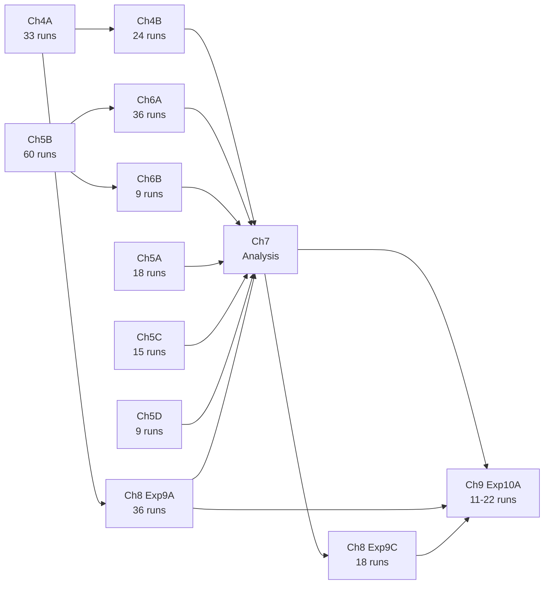

# Thesis Execution Plan: Part II + Part III Training

## Canonical Baseline Anchor

Every experiment in Chapters 4-8 builds on this baseline. All axes not under study are held at these values. The baseline itself must be run with 3 seeds (42, 123, 314) for cross-chapter AUROC normalisation.

```yaml
# Task (REQUIRED in every config — h5_tokens.yaml defaults to [1,2] i.e. 4t-vs-ttH only)
data:
  classifier:
    signal_vs_background:
      signal: 1
      background: [2, 3, 4, 5]

# Model (from configs/classifier/model/transformer.yaml defaults)
classifier:
  globals:
    include_met: false              # D02
  model:
    tokenizer:
      name: raw                     # T1
      pid_mode: learned             # T1-a (irrelevant for raw)
      id_embed_dim: 8               # T1-b (irrelevant for raw)
    dim: 256                        # H01 (base preset)
    depth: 6                        # H02
    heads: 8                        # H03
    mlp_dim: 1024                   # H04
    dropout: 0.1                    # H05
    positional: sinusoidal          # E1
    positional_space: model         # E1-a
    positional_dim_mask: null       # E1-a1
    norm:
      policy: pre                   # A1
      type: layernorm               # A2
    attention:
      type: standard                # A3
      norm: none                    # A4
      diff_bias_mode: shared        # A3-a (irrelevant for standard)
    causal_attention: false         # A5
    ffn:
      type: standard                # F1
    attention_biases: "none"        # B1
    head:
      type: linear                  # C1
      pooling: cls                  # C2
    moe:
      enabled: false                # F1 (MoE off)
    nodewise_mass:
      enabled: false                # P1
    mia_blocks:
      enabled: false                # P2
  trainer:
    epochs: 50
    lr: 0.0001
    weight_decay: 0.01
    batch_size: 64
    seed: 42
    label_smoothing: 0.0
    warmup_steps: 1000
    lr_schedule: cosine
    grad_clip: 1.0
    early_stopping:
      enabled: false

# Data (from configs/data/h5_tokens.yaml)
data:
  cont_features: [0, 1, 2, 3]      # D01
  # D03 = input_order (no shuffle, no sort override)
```

**Per-chapter baseline overrides** (cumulative findings carry forward):

| Chapter | Overrides from canonical |
|---------|--------------------------|
| Ch 4 | None (pure defaults) |
| Ch 5 | `T1=identity, T1-a=learned, T1-b=8, D02=true` |
| Ch 6 | Ch 5 baseline + best Lorentz feature set from Exp 5B |
| Ch 8 | Best D01 from Ch 4 + identity tokenizer |
| Ch 9 | Recommended config from Ch 7 + Pareto size from Ch 8 |

---

## Chapter 4: Best Input Representation

### 4.1 Summary

**Thesis question:** Which input representation choices matter -- tokenizer family (T1), PID encoding (T1-a, T1-b), feature set (D01), MET inclusion (D02), and token ordering (D03)?

**Axes varied:** T1, T1-a, T1-b (Exp 4A); D01, D02, D03 (Exp 4B). Reference: Table 4.1 and Table 4.2 in the PDF.

**Expected outputs:** AUROC comparison across tokenizer families; failure analysis on test set (raw vs identity); cross-task check on 4t-vs-ttH.

### 4.2 Code Changes

No code changes required. All axes (T1, T1-a, T1-b, D01, D02, D03) already exist in the codebase:

- Tokenizer: `classifier.model.tokenizer.name` / `.pid_mode` / `.id_embed_dim` ([configs/classifier/model/transformer.yaml](configs/classifier/model/transformer.yaml) lines 192-197)
- Features: `data.cont_features` ([configs/data/h5_tokens.yaml](configs/data/h5_tokens.yaml) line 24)
- MET: `classifier.globals.include_met` ([configs/classifier/model/transformer.yaml](configs/classifier/model/transformer.yaml) line 7)
- Token order: `data.shuffle_tokens` ([configs/data/order/shuffled.yaml](configs/data/order/shuffled.yaml))

**Verify before writing configs:** Check that `tokenizer.name=binned` works with the default data path (`4tops_splitted.h5`); binned tokenizer may require `4tops_5bins_ours.h5` via `data: h5_tokens_binned`. The executing agent must test a dry run of the binned config.

### 4.3 Experiment Configs and HPC Commands

#### Exp 4A: Tokenizer family and PID encoding (Table 4.1)

Cannot be a single Cartesian sweep because `pid_mode`/`id_embed_dim` are only meaningful for `T1=identity`. Split into 2 configs:

**Config 1:** `ch4_input_repr_exp4a_1.yaml` -- raw and binned tokenizers

- Sweep: `tokenizer.name: raw,binned` x `seed: 42,123,314`
- Runs: 2 x 3 = **6**
- Note: binned may need `data: h5_tokens_binned` override (check dry run)

**Config 2:** `ch4_input_repr_exp4a_2.yaml` -- identity tokenizer

- Sweep: `pid_mode: learned,one_hot,fixed_random` x `id_embed_dim: 8,16,32` x `seed: 42,123,314`
- Fixed: `tokenizer.name: identity`
- Runs: 3 x 3 x 3 = **27**
- Note: when `pid_mode=one_hot`, `id_embed_dim` is overridden to `num_types` (gotcha from AXES_REFERENCE_V2.md section 0.3). This means some configs are effectively duplicates. The 33-run count in Table 4.1 suggests the thesis counts them as distinct configs regardless.

**Total Exp 4A:** 33 runs

Test commands:
```bash
condor_submit hpc/stoomboot/train.sub -append \
  'arguments = env=stoomboot data.limit_samples=500 classifier.trainer.epochs=1 logging.use_wandb=false classifier/experiment=thesis_experiments/ch4_input_repr_exp4a_1 --multirun'

condor_submit hpc/stoomboot/train.sub -append \
  'arguments = env=stoomboot data.limit_samples=500 classifier.trainer.epochs=1 logging.use_wandb=false classifier/experiment=thesis_experiments/ch4_input_repr_exp4a_2 --multirun'
```

Production commands: same without `data.limit_samples=500 classifier.trainer.epochs=1 logging.use_wandb=false`.

#### Exp 4B: Feature content and token ordering (Table 4.2)

**Config:** `ch4_data_treatment_exp4b.yaml`

- Fixed: `T1=identity, T1-a=learned, T1-b=8` (best from 4A, thesis assumes identity)
- Sweep: `data.cont_features: "[0,1,2,3],[1,2,3]"` x `classifier.globals.include_met: false,true` x `data.shuffle_tokens: false,true` x `seed: 42,123,314`
- Runs: 2 x 2 x 2 x 3 = **24**
- Note: `data.shuffle_tokens=true` maps to `D03=shuffled`; `false` maps to `input_order`.

**Total Exp 4B:** 24 runs

**Cross-task checks** (additional, not in main table):

- Re-run Exp 4A best tokenizer + Exp 4B MET axis on 4t-vs-ttH task. For 4t-vs-ttH, omit the `data.classifier.signal_vs_background` block (h5_tokens.yaml default `selected_labels: [1,2]` gives 4t-vs-ttH). Estimate ~6-12 additional runs.

### 4.4 Analysis Plan (deferred)

- AUROC bar chart by tokenizer family (4A) and by D01/D02/D03 (4B)
- Failure analysis: for test events, compare predictions from raw vs identity models; identify events that flip from incorrect to correct when PID is added
- Cross-task AUROC check on 4t-vs-ttH
- Permutation-invariance check from D03=shuffled results

---

## Chapter 5: Physics-Informed Attention Biases

### 5.1 Summary

**Thesis question:** Does injecting physics structure as additive attention biases improve classification, and what do learned bias weights reveal?

**Axes varied:** B1, B1-L1, B1-L2, B1-L5, B1-T2, B1-T3, B1-S1. Reference: Tables 5.1--5.4.

**Chapter baseline:** `T1=identity, D02=true, E1=sinusoidal`, all other axes at canonical defaults. Total chapter runs: 102.

### 5.2 Code Changes

No training code changes required. All bias families and sub-axes exist:

- `classifier.model.attention_biases` with `+` notation ([transformer.yaml](configs/classifier/model/transformer.yaml) lines 95-96)
- `bias_config.lorentz_scalar.*` (lines 102-107)
- `bias_config.typepair_kinematic.*` (lines 112-116)
- `bias_config.sm_interaction.*` (lines 120-121)
- `bias_config.global_conditioned.*` (lines 126-129)

Existing experiment configs in [configs/classifier/experiment/bias_experiments/](configs/classifier/experiment/bias_experiments/) provide patterns for list-valued sweeps and `+` bias notation.

**Post-training extraction:** The interpretability system ([configs/classifier/trainer/default.yaml](configs/classifier/trainer/default.yaml) lines 47-53) supports `save_attention_maps`, `save_kan_splines`. Enable these in the config for runs where post-hoc extraction is needed (Exp 5B KAN curves, Exp 5C heatmaps). Sparse gate values (B1-L5) should be extractable from the saved checkpoint (`best_val.pt`).

### 5.3 Experiment Configs and HPC Commands

#### Exp 5A: Bias family comparison (Table 5.1)

**Config:** `ch5_bias_families_exp5a.yaml`

- Chapter baseline: `T1=identity, D02=true`
- Sweep: `attention_biases: "none,lorentz_scalar,typepair_kinematic,sm_interaction,global_conditioned,lorentz_scalar+typepair_kinematic+sm_interaction+global_conditioned"` x `seed: 42,123,314`
- Fixed: `bias_config.global_conditioned.mode: met_direction` (requires D02=true)
- Runs: 6 x 3 = **18**
- Note: The `global_conditioned` family requires `D02=true` and `met_direction` requires MET present. Verify this combination in dry run.

#### Exp 5B: Lorentz feature set and bias network (Table 5.2)

**Config:** `ch5_lorentz_ablation_exp5b.yaml`

- Fixed: `attention_biases: lorentz_scalar`, chapter baseline
- Sweep: `features` x `mlp_type` x `sparse_gating` x `seed`
  - `bias_config.lorentz_scalar.features: "[m2],[deltaR],[m2,deltaR],[log_kt,z,deltaR,log_m2],[m2,deltaR,log_m2,log_kt,z,deltaR_ptw]"`
  - `bias_config.lorentz_scalar.mlp_type: standard,kan`
  - `bias_config.lorentz_scalar.sparse_gating: false,true`
  - `classifier.trainer.seed: 42,123,314`
- Runs: 5 x 2 x 2 x 3 = **60**
- Note: When `mlp_type=kan`, the shared `§K` KAN hyperparameters apply (grid_size=5, spline_order=3). This is the default and is correct.
- Note: Enable `interpretability.save_kan_splines: true` for `mlp_type=kan` runs to extract activation curves post-hoc. This may need to be a separate CLI override on a subset of runs rather than in the sweeper.

#### Exp 5C: Type-pair initialisation and freeze (Table 5.3)

**Config:** `ch5_typepair_init_exp5c.yaml`

- Fixed: `attention_biases: typepair_kinematic`, chapter baseline
- Sweep: `init_from_physics: none,binary,fixed_coupling` x `freeze_table: false,true` x `seed: 42,123,314`
- Exclude: `init_from_physics=none, freeze_table=true` (meaningless: freezing a random table)
- Runs: (3 x 2 - 1) x 3 = 5 x 3 = **15**
- Note: Hydra basic sweeper cannot exclude combos. Either split into 2 configs or produce 18 runs and discard the 3 invalid ones. Recommend splitting:
  - Part 1: `init_from_physics: none` with `freeze_table: false` (1 config x 3 seeds = 3 runs)
  - Part 2: `init_from_physics: binary,fixed_coupling` x `freeze_table: false,true` (4 configs x 3 seeds = 12 runs)
  - Total: 15

#### Exp 5D: SM interaction mode (Table 5.4)

**Config:** `ch5_sm_mode_exp5d.yaml`

- Fixed: `attention_biases: sm_interaction`, chapter baseline
- Sweep: `bias_config.sm_interaction.mode: binary,fixed_coupling,running_coupling` x `seed: 42,123,314`
- Runs: 3 x 3 = **9**

**Total Chapter 5:** 102 runs

### 5.4 Analysis Plan (deferred)

- AUROC bar chart for Exp 5A (6 bias configs)
- Attention maps: extract for `none` baseline and full combination, averaged over a fixed held-out batch, labelled by particle type
- Lorentz feature importance from sparse gate values (Exp 5B)
- KAN activation curves from saved splines (Exp 5B, mlp_type=kan runs)
- Type-pair table heatmaps from checkpoint weights (Exp 5C)
- SM mode comparison (Exp 5D, expected null result)

---

## Chapter 6: Attention Mechanisms

### 6.1 Summary

**Thesis question:** Does differential attention transfer from NLP to particle classification? How does it interact with physics biases?

**Axes varied:** A3, A4, B1 (Exp 6A); A3-a (Exp 6B). Reference: Tables 6.1--6.2.

**Chapter baseline:** Ch 5 baseline + `B1=lorentz_scalar` with best feature set from Exp 5B.

**Total chapter runs:** 45.

### 6.2 Code Changes

No code changes required. All axes exist:

- `classifier.model.attention.type` (standard/differential)
- `classifier.model.attention.norm` (none/layernorm/rmsnorm)
- `classifier.model.attention.diff_bias_mode` (none/shared/split)

Wall-clock time per epoch is already logged as `perf/epoch_time_s` in the transformer_classifier loop (line 1014 of [transformer_classifier.py](src/thesis_ml/training_loops/transformer_classifier.py)).

### 6.3 Experiment Configs and HPC Commands

#### Exp 6A: Attention type and internal normalisation (Table 6.1)

**Config:** `ch6_attention_type_exp6a.yaml`

- Chapter baseline (T1=identity, D02=true, best Lorentz features from 5B)
- Sweep: `attention.type: standard,differential` x `attention.norm: none,layernorm,rmsnorm` x `attention_biases: none,lorentz_scalar` x `seed: 42,123,314`
- When `attention_biases=lorentz_scalar`: use best feature set from Ch 5
- Runs: 2 x 3 x 2 x 3 = **36**
- **Dependency:** Requires Exp 5B results to determine `lorentz_scalar.features`. Until results are available, use `[m2, deltaR]` (ParT default) as placeholder.

#### Exp 6B: Differential bias mode (Table 6.2)

**Config:** `ch6_diff_bias_mode_exp6b.yaml`

- Fixed: `attention.type: differential`, `attention_biases: lorentz_scalar` (best features from 5B)
- Sweep: `attention.diff_bias_mode: none,shared,split` x `seed: 42,123,314`
- Runs: 3 x 3 = **9**

**Total Chapter 6:** 45 runs

### 6.4 Analysis Plan (deferred)

- AUROC bar chart for all 12 configs in Exp 6A, with `perf/epoch_time_s` as secondary axis
- Attention maps for standard vs differential (both with A4=none, B1=none), averaged over held-out batch
- Three-row AUROC table for Exp 6B (none/shared/split)

---

## Chapter 7: What Matters -- A Global Analysis

### 7.1 Summary

**Thesis question:** Across the entire experiment database (Chs 4-6 + existing exploratory runs), which axes consistently move the needle?

No new models are trained. The W&B database is frozen, all runs are backfilled with V2 axis vectors, and analysis operates on a single table: one row per model, one column per axis, plus AUROC.

### 7.2 Code Changes

New scripts/analysis work required:

1. **W&B axis backfill script:** Ensure every run in the W&B project carries the complete V2 axis vector. The existing `build_axes_metadata(cfg)` in [src/thesis_ml/facts/axes.py](src/thesis_ml/facts/axes.py) extracts axes from config. A backfill script should load `.hydra/config.yaml` from each run and update W&B with any missing `axes/*` keys. Check if `scripts/wandb/` has existing backfill utilities; if not, create `scripts/wandb/backfill_v2_axes.py`.

2. **Run database export:** Export the filtered W&B table (primary task, default model size) to CSV. The must-have columns are listed in [AXES_REFERENCE_V2.md](docs/AXES_REFERENCE_V2.md) section 8.

3. **Marginal sensitivity analysis:** Script that groups runs by each axis value, computes group-mean AUROC, and ranks axes by the range (max - min group mean). Noise floor threshold: ~0.002 AUROC (seed-level noise). Output: ranked bar chart colour-coded by axis family.

4. **BDT surrogate model:** Train a gradient-boosted decision tree (XGBoost/LightGBM, not the codebase's BDT loop) on the run database to predict AUROC from axis configuration vectors. Extract feature importances for a second, independent axis ranking. Output: predicted AUROC for untrained configurations, top-5 recommended configs.

5. **Recommended configuration:** Combine marginal and surrogate findings into a single Hydra override string. This feeds into Ch 9.

### 7.3 Experiment Configs and HPC Commands

No training jobs. Analysis runs locally or on a single CPU node.

### 7.4 Analysis Plan

- Freeze W&B database after all Ch 4-6 runs complete
- Backfill V2 axis vectors for any run missing `axes/*` keys
- Export filtered table: primary task, default model size, completed runs only
- Marginal sensitivity: ranked bar chart spanning all axes
- Null result panels for PE type, norm policy, causal masking (flat marginal distributions)
- BDT surrogate: feature importances + predicted top configs
- State recommended configuration as a Hydra override block

---

## Chapter 8: Model Scaling and Efficiency

### 8.1 Summary

**Thesis question:** Do the axis rankings from Chs 4-7 hold at other model scales? Where on the performance-cost curve should a practitioner operate?

**Axes varied:** Model size (H), classification task (G03). Reference: Tables 8.1--8.2. The experiment numbers in the thesis are 9A, 9B, 9C.

**Total chapter runs:** 54 (36 training + 0 post-hoc + 18 training).

### 8.2 Code Changes

**Model size presets:** The thesis specifies 4 sizes: `d32_L3`, `d64_L6`, `d128_L8`, `d256_L12`. Check existing presets:

| Thesis label | Closest preset | Match? |
|-------------|----------------|--------|
| d32_L3 | s50k (d32_L5) | Depth mismatch |
| d64_L6 | s200k (d64_L6_h8_m128) | Exact |
| d128_L8 | s1m (d128_L8_h8_m256) | Exact |
| d256_L12 | None (base=d256_L6, s4m=d192_L12) | No match |

**Action:** Create 2 new model_size presets in [configs/classifier/model_size/](configs/classifier/model_size/):

- `d32_L3.yaml`: `dim=32, depth=3, heads=4, mlp_dim=64`
- `d256_L12.yaml`: `dim=256, depth=12, heads=8, mlp_dim=1024`

Or, if the user prefers using existing presets (s50k, s200k, s1m, s4m) which span the same 50k-4M range, no new files are needed. The executing agent should confirm with the user which preset names to use.

**Multiclass task:** Requires `data.classifier.selected_labels: [1, 2, 3, 4, 5]` for 5-class. The training loop already supports multiclass (metrics include AUROC via one-vs-rest averaging). Verify with a dry run.

**Inference throughput script (Exp 9B):** The training loop already logs `perf/throughput_samples_sec` to W&B per epoch. For a dedicated inference benchmark, a lightweight script that loads a checkpoint and times `model.eval()` forward passes would be needed. Check if this exists; if not, create `scripts/check/inference_benchmark.py`. Alternatively, extract `perf/throughput_samples_sec` from W&B for the final epoch.

### 8.3 Experiment Configs and HPC Commands

#### Exp 9A: Scaling curves across tasks (Table 8.1)

**Config:** `ch8_scaling_curves_exp9a.yaml` (may need splitting by task if `signal_vs_background` and `selected_labels` conflict)

- Common baseline: `T1=identity, best D01 from Ch 4, E1=sinusoidal, no physics biases`
- Sweep: `+classifier/model_size: d32_L3,s200k,s1m,d256_L12` x `seed: 42,123,314`
- Task dimension requires 3 separate configs (different `data.classifier` blocks):
  - Part 1: `ch8_scaling_exp9a_1_4t_vs_bg.yaml` -- `signal_vs_background` (primary)
  - Part 2: `ch8_scaling_exp9a_2_4t_vs_ttH.yaml` -- `selected_labels: [1, 2]`
  - Part 3: `ch8_scaling_exp9a_3_multiclass.yaml` -- `selected_labels: [1, 2, 3, 4, 5]`
- Runs per task: 4 x 3 = 12
- **Total Exp 9A:** 36

#### Exp 9B: Efficiency metrics (Table not applicable)

No new training. Extract from Exp 9A W&B data:
- `perf/throughput_samples_sec` (last epoch)
- `perf/epoch_time_s` (average)
- Epochs to 95% of final AUROC (compute from `val/auroc` history)

Plot Pareto panel: AUROC vs each efficiency metric, one curve per task.

#### Exp 9C: Axis transfer across scales (Table 8.2)

**Config:** `ch8_axis_transfer_exp9c.yaml`

- **Dependency:** Requires Ch 7 results (top-2 most impactful axes). Cannot write config until Ch 7 analysis is complete.
- Primary task only.
- Sweep: top-2 axes (best vs default setting) x `+classifier/model_size: d32_L3,s200k,d256_L12` x `seed: 42,123,314`
- Runs: 2 x 3 x 3 = **18**
- Placeholder structure: 2 axis values x 3 sizes x 3 seeds, but the specific axes and values are determined by Ch 7.

**Total Chapter 8:** 54 runs (36 + 0 + 18)

### 8.4 Analysis Plan (deferred)

- Three scaling curves (one per task): seed-averaged AUROC vs parameter count (log scale)
- Signal efficiency at fixed background rejection 1/B = 50
- Pareto panel: AUROC vs inference throughput / wall-clock / epochs to 95%
- Axis transfer check: verify Ch 4-6 rankings hold at smallest and largest scales

---

## Chapter 9: The Best Model and Its Physics Reach

### 9.1 Summary

**Thesis question:** How does the recommended configuration compare to baselines, and what does the AUROC improvement mean in physics terms?

**Dependencies:** Recommended config from Ch 7, Pareto-optimal size from Ch 8.

**Total chapter runs:** 11 training + analysis.

### 9.2 Code Changes

**MIParT baseline:** The codebase has MIA blocks (`P2`) that implement MIParT-style pre-encoder. For a fair MIParT comparison, configure: `mia_blocks.enabled=true, mia_blocks.num_blocks=5, mia_blocks.placement=prepend`, with appropriate model dimensions matching the MIParT paper. The executing agent should determine the correct MIParT hyperparameters from Wu et al. (2025).

**Profile likelihood (Exp 10B):** If pursued, requires a new analysis script `scripts/analysis/profile_likelihood.py` that:
1. Loads classifier scores from test set
2. Constructs binned discriminant
3. Scales yields to target luminosity
4. Computes expected significance under asymptotic approximation
5. Scans luminosity to find L_5sigma

This is optional per the thesis ("may not appear in the final thesis").

### 9.3 Experiment Configs and HPC Commands

#### Exp 10A: The recommended model (Table 9.1)

Three model configs, each evaluated on both tasks (4t-vs-bg and 4t-vs-ttH). Test evaluation is automatic (`test/auroc` logged at training end), so secondary task evaluation requires separate training runs.

**Config 1:** `ch9_recommended_exp10a_1.yaml` -- recommended model

- Config: best axis settings from Ch 7, Pareto-optimal size from Ch 8
- Seeds: 42, 123, 314, 0, 7 (5 seeds for final model)
- Runs: **5** (per task, 10 total across both tasks)

**Config 2:** `ch9_simple_baseline_exp10a_2.yaml` -- simple baseline

- Config: `T1=raw, attention_biases=none, +classifier/model_size=d32_L3` (simplest transformer)
- Seeds: 42, 123, 314
- Runs: **3** (per task, 6 total)

**Config 3:** `ch9_mipart_baseline_exp10a_3.yaml` -- MIParT reference

- Config: MIParT architecture (`mia_blocks.enabled=true`, appropriate dims from Wu et al.)
- Seeds: 42, 123, 314
- Runs: **3** (per task, 6 total)

**Total Exp 10A:** 11 runs per task, 22 total across both tasks (thesis table says 11, likely counting primary task only or counting model training once and evaluating both tasks from same checkpoint).

Note: If the training loop evaluates only the task it was trained on (determined by `data.classifier`), then cross-task evaluation from the same checkpoint requires a separate inference script. The executing agent must verify this.

#### Exp 10B: Physics sensitivity (optional)

No training. Post-hoc analysis on Exp 10A checkpoints using the profile likelihood script.

### 9.4 Analysis Plan (deferred)

- AUROC and signal efficiency at 1/B = 50 for all three models on both tasks
- Seed-averaged means and error bars (thesis headline numbers)
- Luminosity-vs-significance curves (if Exp 10B proceeds)
- L_5sigma comparison across classifiers

---

## Cross-Cutting Sections

### Seed Strategy

| Context | Seeds | Count |
|---------|-------|-------|
| Standard ablation (Chs 4-6) | 42, 123, 314 | 3 |
| Ch 9 final model (Exp 10A recommended) | 42, 123, 314, 0, 7 | 5 |
| Exploratory sub-experiments (where PDF says 1 seed) | 42 | 1 |

All seeds are set via `classifier.trainer.seed` in Hydra sweeper params.

### Execution Timeline

```
Week 1 (parallel launch):
  Ch 4A: 33 runs (tokenizer family)         ~33 GPU-hours
  Ch 5A: 18 runs (bias family comparison)   ~18 GPU-hours
  Ch 5B: 60 runs (Lorentz ablation)         ~60 GPU-hours
  Ch 5C: 15 runs (type-pair init/freeze)    ~15 GPU-hours
  Ch 5D:  9 runs (SM interaction mode)       ~9 GPU-hours
  Baseline anchor: 3 runs (3 seeds)          ~3 GPU-hours
  ───────────────────────────────────────────────────────
  Total: 138 runs, ~138 GPU-hours

Week 2 (after Ch 4A and Ch 5B complete):
  Ch 4B: 24 runs (feature/MET/order)        ~24 GPU-hours
  Ch 6A: 36 runs (attention type+norm)      ~36 GPU-hours
  Ch 6B:  9 runs (diff bias mode)            ~9 GPU-hours
  Ch 4+5 cross-task checks: ~12 runs        ~12 GPU-hours
  Ch 8 Exp 9A: 36 runs (scaling curves)     ~36 GPU-hours  [*]
  ───────────────────────────────────────────────────────
  Total: ~117 runs, ~117 GPU-hours

  [*] Ch 8 Exp 9A can start as soon as Ch 4 results determine best D01.
      Large models (d256_L12) may need 32 GB RAM; check HPC resources.

Week 3 (after all Ch 4-6 + Ch 8 9A complete):
  Ch 7: analysis work (no GPU, 1-2 days)
  Ch 8 Exp 9C: 18 runs (axis transfer)     ~18 GPU-hours
  Ch 9 Exp 10A: 11-22 runs (final model)   ~22 GPU-hours
  ───────────────────────────────────────────────────────
  Total: ~40 runs, ~40 GPU-hours
```

**Parallelism notes:**
- Ch 4A and all of Ch 5 are independent and can run in parallel from day 1
- Ch 4B depends on Ch 4A (uses best tokenizer)
- Ch 6 depends on Ch 5B (uses best Lorentz feature set)
- Ch 8 Exp 9A depends on Ch 4 (best D01); can run in parallel with Ch 6
- Ch 8 Exp 9C depends on Ch 7 (top-2 axes)
- Ch 9 depends on Ch 7 + Ch 8 (recommended config + Pareto size)



### Risk Register

| Risk | Impact | Mitigation |
|------|--------|------------|
| OOM on d256_L12 (largest model size, ~4M params) | Exp 9A/9C/10A fail on HPC | Pre-test with `data.limit_samples=500, epochs=1`. Increase `request_memory` in `train.sub` to 24-32 GB if needed. Consider gradient accumulation or smaller batch size. |
| Binned tokenizer requires different dataset file | Exp 4A Part 1 fails for binned | Dry-run `tokenizer.name=binned` with `data: h5_tokens_binned` override. If needed, split into 3 configs. |
| Hydra sweeper cannot exclude combinations | Exp 5C has 1 invalid combo (init=none, freeze=true) | Split into 2 config files (see Exp 5C plan). |
| `§K` shared coupling: changing KAN params in Exp 5B also affects head/bias KAN if both active | Unintended side effects | Only `lorentz_scalar` is active in Exp 5B (no KAN head/FFN). Verify in dry run. |
| Multiclass task (5-class, Exp 9A) may need different AUROC aggregation | Misleading metric | Verify training loop uses macro-averaged one-vs-rest AUROC for multiclass. |
| Ch 7 run count insufficient for BDT surrogate | Weak predictions | Target minimum ~200 runs in the filtered database. If fewer, use simpler model (random forest) or wider regularisation. |
| Config key mismatch between AXES_REFERENCE_V2 and actual code | Silent misconfig | Every config YAML must be dry-run tested with `data.limit_samples=500, epochs=1` before production. The executing agent must verify all Hydra keys against AXES_REFERENCE_V2.md section 6. |
| `mia_blocks.placement=interleave` falls back to `prepend` | MIParT baseline may not match paper exactly | Use `prepend` explicitly. Document deviation from paper if relevant. |
| Wall-clock timing variability on shared HPC nodes | Noisy `perf/epoch_time_s` data for Ch 6 | Average over multiple epochs (not just epoch 1). Exp 9B efficiency analysis should use median epoch time. |

### Config File Summary

All new configs go in `configs/classifier/experiment/thesis_experiments/`:

| Filename | Chapter | Experiment | Runs |
|----------|---------|------------|------|
| `ch4_input_repr_exp4a_1.yaml` | 4 | 4A (raw+binned) | 6 |
| `ch4_input_repr_exp4a_2.yaml` | 4 | 4A (identity) | 27 |
| `ch4_data_treatment_exp4b.yaml` | 4 | 4B | 24 |
| `ch5_bias_families_exp5a.yaml` | 5 | 5A | 18 |
| `ch5_lorentz_ablation_exp5b.yaml` | 5 | 5B | 60 |
| `ch5_typepair_init_exp5c_1.yaml` | 5 | 5C (init=none) | 3 |
| `ch5_typepair_init_exp5c_2.yaml` | 5 | 5C (binary/fixed) | 12 |
| `ch5_sm_mode_exp5d.yaml` | 5 | 5D | 9 |
| `ch6_attention_type_exp6a.yaml` | 6 | 6A | 36 |
| `ch6_diff_bias_mode_exp6b.yaml` | 6 | 6B | 9 |
| `ch8_scaling_exp9a_1_4t_vs_bg.yaml` | 8 | 9A (primary) | 12 |
| `ch8_scaling_exp9a_2_4t_vs_ttH.yaml` | 8 | 9A (secondary) | 12 |
| `ch8_scaling_exp9a_3_multiclass.yaml` | 8 | 9A (multiclass) | 12 |
| `ch8_axis_transfer_exp9c.yaml` | 8 | 9C (deferred) | 18 |
| `ch9_recommended_exp10a_1.yaml` | 9 | 10A (recommended) | 5-10 |
| `ch9_simple_baseline_exp10a_2.yaml` | 9 | 10A (baseline) | 3-6 |
| `ch9_mipart_baseline_exp10a_3.yaml` | 9 | 10A (MIParT) | 3-6 |

**New model_size presets** (if thesis labels are taken literally):

| Filename | dim | depth | heads | mlp_dim |
|----------|-----|-------|-------|---------|
| `d32_L3.yaml` | 32 | 3 | 4 | 64 |
| `d256_L12.yaml` | 256 | 12 | 8 | 1024 |

### Key Verification Checklist (for Executing Agent)

Before writing any config YAML:

1. Verify all Hydra config keys against [AXES_REFERENCE_V2.md](docs/AXES_REFERENCE_V2.md) section 6
2. Dry-run every config with `data.limit_samples=500 classifier.trainer.epochs=1 logging.use_wandb=false`
3. Confirm `test/auroc` appears in W&B after dry run (already verified: logged at training end)
4. Confirm `perf/epoch_time_s` appears in W&B (already verified)
5. Confirm multiclass (5-class) works with `selected_labels: [1,2,3,4,5]`
6. Confirm binned tokenizer works (may need `data: h5_tokens_binned`)
7. Confirm d256_L12 fits in 16 GB GPU RAM (increase `request_memory` if not)
